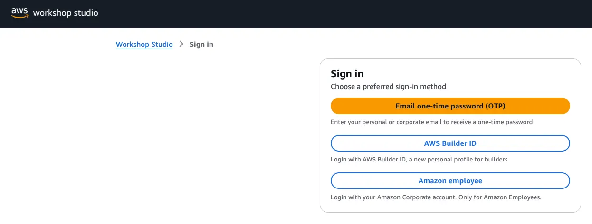
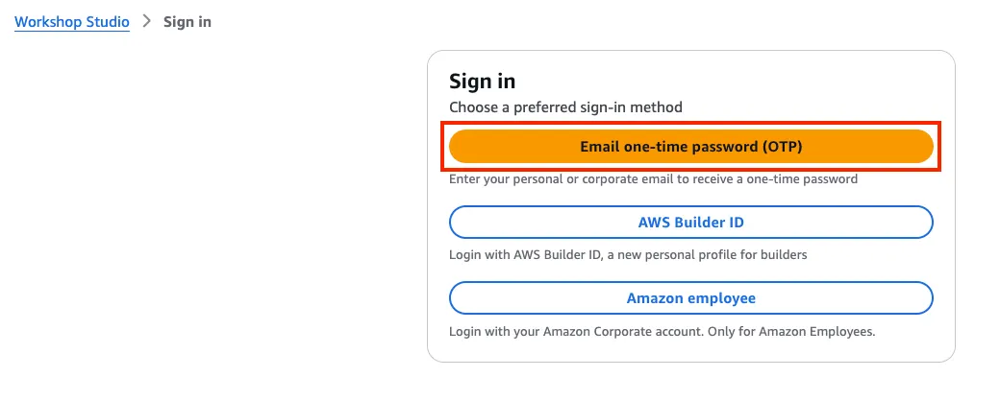
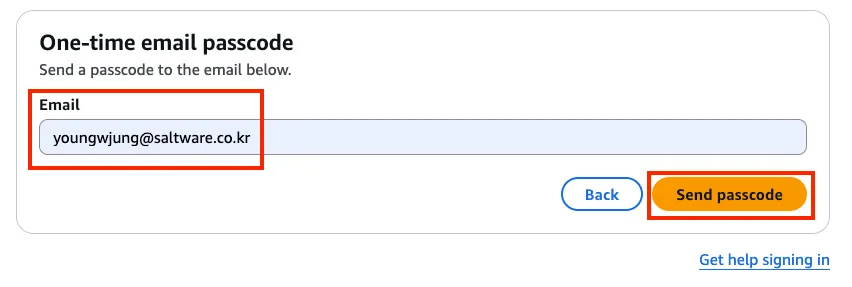
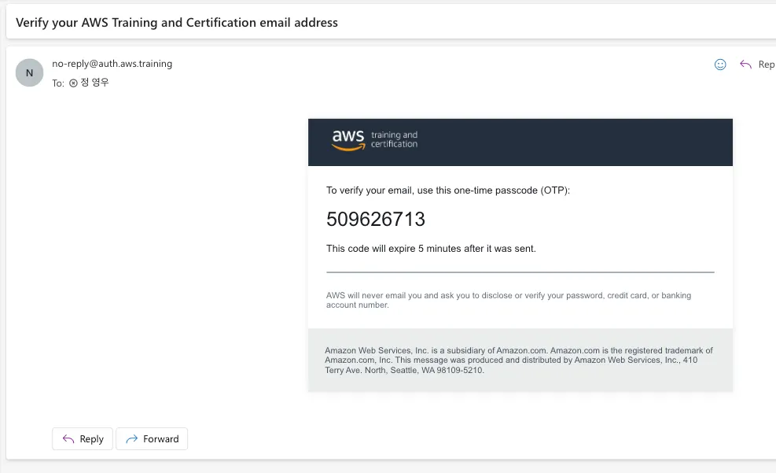
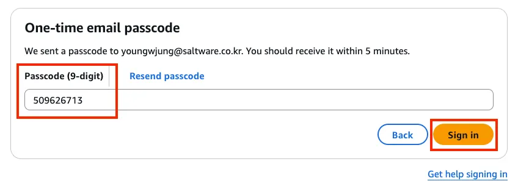
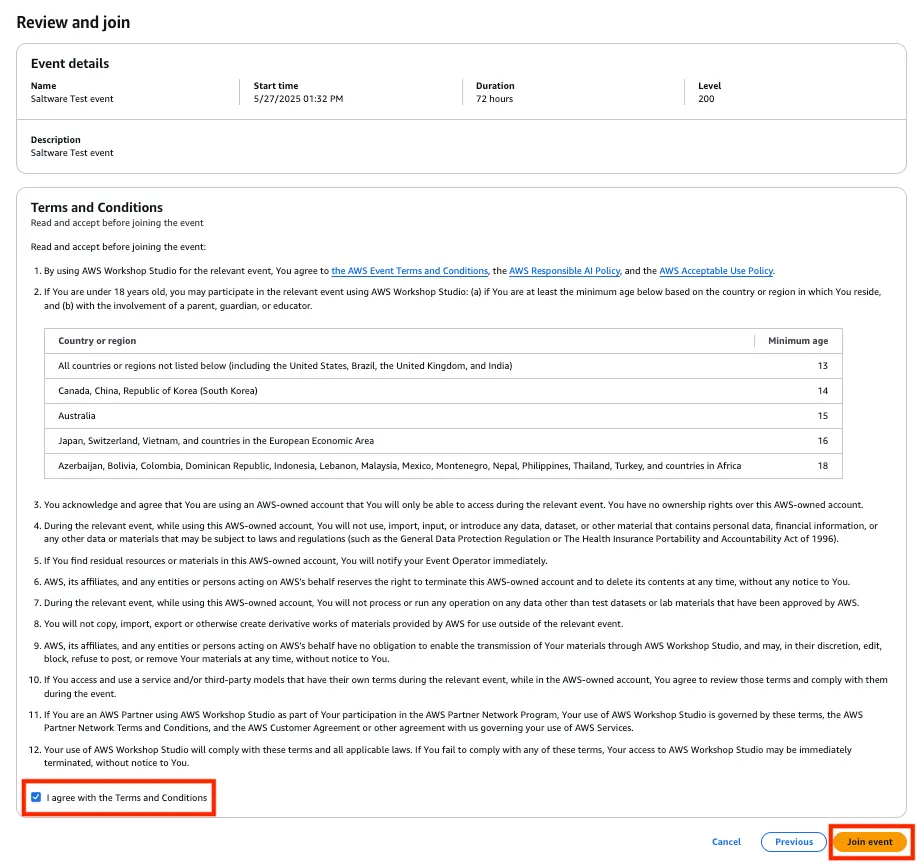
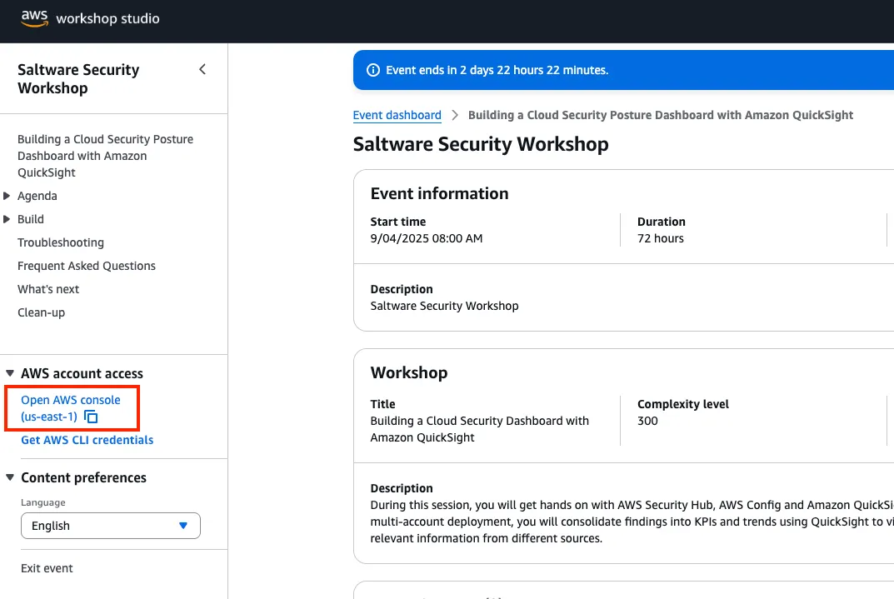
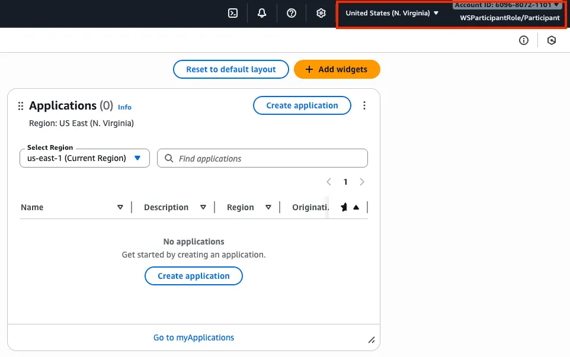

# Workshop Studio 로그인
AWS 주최 이벤트에 참여하는 경우 AWS Workshop Studio 라는 플랫폼을 사용하게 됩니다. 
이 플랫폼을 통해 AWS 현장 팀은 AWS 계정 또는 리소스에 대한 실습 액세스가 필요한 워크샵, Game Days, Boot camps, Immersion Days 및 기타 이벤트를 실행할 수 있습니다.

1. 제공된 URL을 통해서 AWS Worshop Studio로 이동합니다.

 

2. Sign in 화면에서 로그인 방식을 "Email one-time-password (OTP)" 로 선택합니다.

 

3. 이벤트 등록에 사용한 이메일 주소를 입력하고 Send passcode를 눌러 OTP를 발급합니다.

 

4. 수신된 이메일에서 OTP를 확인합니다.

 

5. 로그인 화면에서 OTP를 입력하고 Sign in을 눌러 로그인합니다.

 

6. 약관을 읽고, 이벤트 등록 화면 하단에 "I agree with this Terms and Conditions" 체크 박스를 선택한 뒤, Join event를 선택합니다.

 

7. 왼쪽 패널에서 "Open AWS console" 을 선택합니다.

 

8. AWS 관리 콘솔에 정상적으로 로그인 되었는지 확인합니다.
