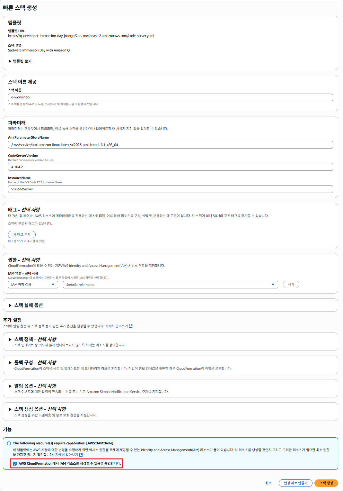
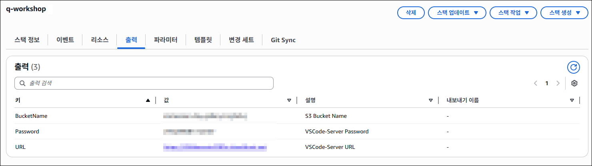

# Code Server ( IDE ) 환경 접속

이 Workshop 에서는 Code Server를 통해 Amazon EC2 인스턴스에서 실행되는 Visual Studio Code를 사용합니다. 
이를 통해 모든 도구가 사전 구성된 일관된 개발 환경을 제공합니다.

1. 해당 <a href="https://ap-northeast-2.console.aws.amazon.com/cloudformation/home?region=ap-northeast-2#/stacks/quickcreate?templateURL=https%3A%2F%2Fq-developer-immersion-day-joung.s3.ap-northeast-2.amazonaws.com%2Fcode-server.yaml&stackName=q-workshop" target="_blank">스택 생성</a> 링크를 클릭해서 실습 환경을 구성하는 CloudFormation 스택을 생성합니다.
    하단에 "I acknowledge that AWS CloudFormation might create IAM resources." 체크박스를 선택하고 "Create stack" 선택하여 스택을 생성합니다.

    

    !!! info
        스택 생성이 완료되기까지 약 7~10분 소모됩니다.
     

2. 스택의 상태가 "CREATE_COMPLETE" 가 되면, [Outputs] 탭을 선택해서 Code Server의 URL과 Password를 확인합니다.

    !!! info
        Bucket Name은 [Amazon Q를 활용한 실제 Application 구성 실습]의 [Task 1: 계획-구성-검증]에서 사용됩니다.
    
    
     
    
3. Code Server의 URL로 접근하고, 비밀번호 입력창이 나오면 2번에서 확인한 Password를 입력합니다.
    
    
    
