# Q Developer 로그인

## Builder ID 생성

!!! warning
    Builder ID가 이미 있으실 경우, Q Developer 인증 항목으로 넘어가시면 됩니다.

AWS Builder Amazon CodeCatalyst, Amazon Q Developer, AWS 교육 및 자격증을 포함한 특정 도구 및 서비스에 대한 액세스를 제공하는 개인 프로필입니다. AWS Builder ID는 무료이며 프로필 생성 시 신용카드 정보를 입력할 필요가 없습니다.

1. 해당 <a href="https://profile.aws.amazon.com/" target="_blank">Builder ID 생성</a> 링크를 클릭해서 Builder ID로 사용할 이메일 주소를 입력하고 "계속"을 선택합니다.

    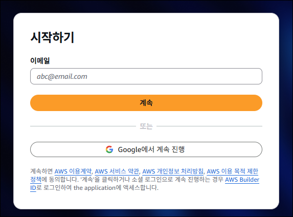
 

2. 이름을 입력하고 "계속"을 선택합니다.
    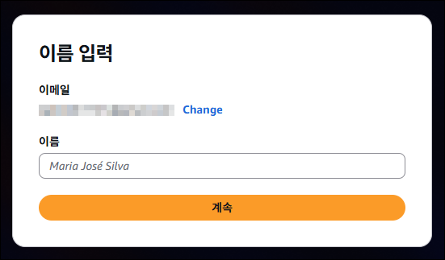
 

3. 이메일 확인 페이지에서 이메일 주소로 전송된 확인 코드를 입력합니다. 확인를 선택합니다. 이메일 공급자에 따라 이메일 수신에 몇 분 정도 걸릴 수도 있습니다. 스팸 및 정크 폴더에서 해당 코드를 확인하세요. 5분 AWS 후에도의 이메일이 표시되지 않으면 코드 재전송을 선택합니다.
 

4. 이메일을 확인한 후 암호 선택 페이지에서 암호를 입력하고 이메일을 확인합니다.
 

5. 생성(Create) AWS Builder ID을 선택합니다.

## Q Developer 인증

1. Code Server IDE 브라우저 환경에 접속하고, 왼쪽 패널의 Amazon Q 확장 프로그램에서 "Use For Free"를 선택하고, "Continue"를 선택합니다.

    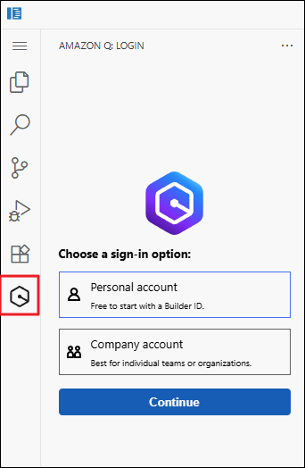
 

2. Confirm 메세지가 표시되면 "Proceed To Browser"를 선택합니다.
    
    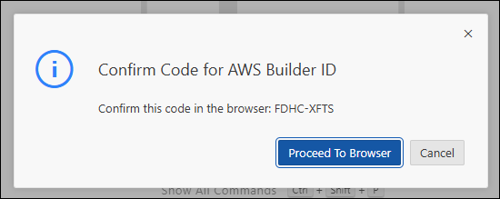
 

3. "Do you want code-server to open the external" 메시지가 표시되면 "Open"을 선택합니다.
    
    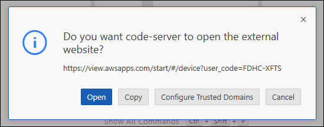
 

4. 로그인 창이 표시되면 가입한 이메일로 로그인 합니다.

    !!! info
        로그인 창이 표시되지 않는다면 5번으로 넘어가시면 됩니다.

    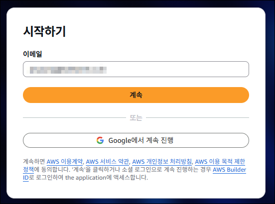
 

5. "승인을 요청함" 메세지가 표시되면 하단에 "확인 및 계속"을 선택합니다.

    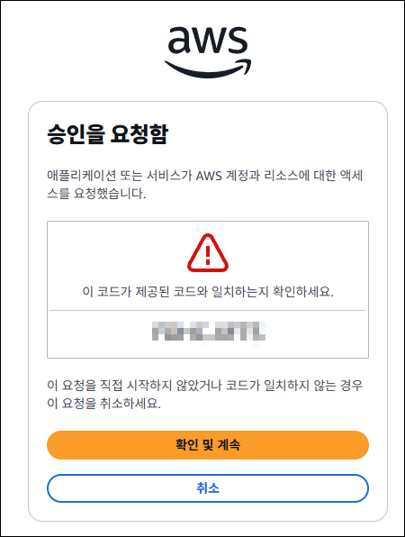

6. "액세스 허용" 메세지가 표시되면 "액세스 허용"을 선택합니다.

    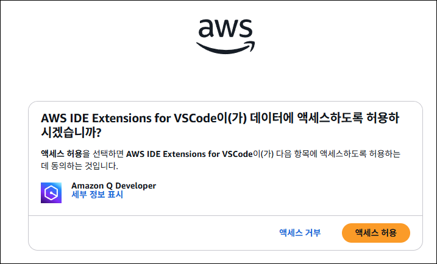

7. IDE 환경에서 Q Chat이 활성화 된 것을 확인하고, 채팅에 "Acknowledge"를 선택합니다.

    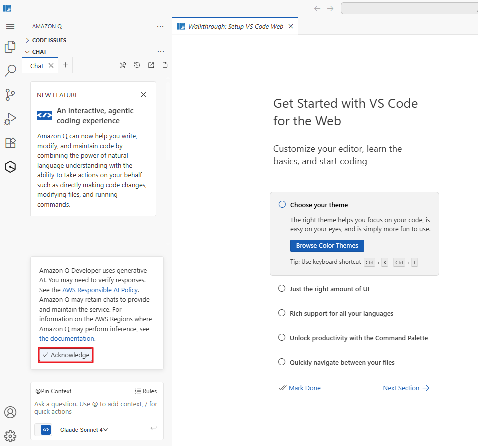

## (선택사항) Amazon Q Chat 패널 위치 옮기기
1. 왼쪽 패널의 Amazon Q에서 헤더 부분을 드래고하여 오른쪽 패널로 옮깁니다.

    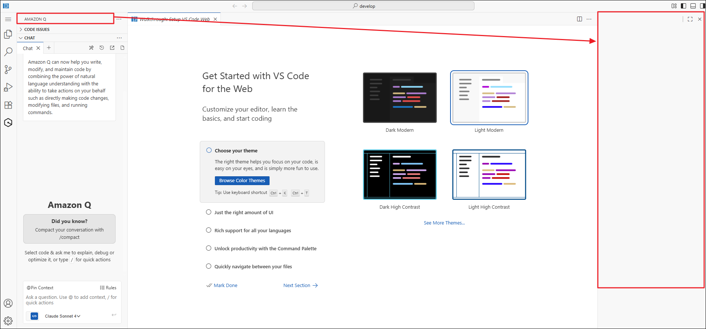

2. 다음과 같이 Explorer와 Chat이 한 눈에 보이는지 확인합니다.

    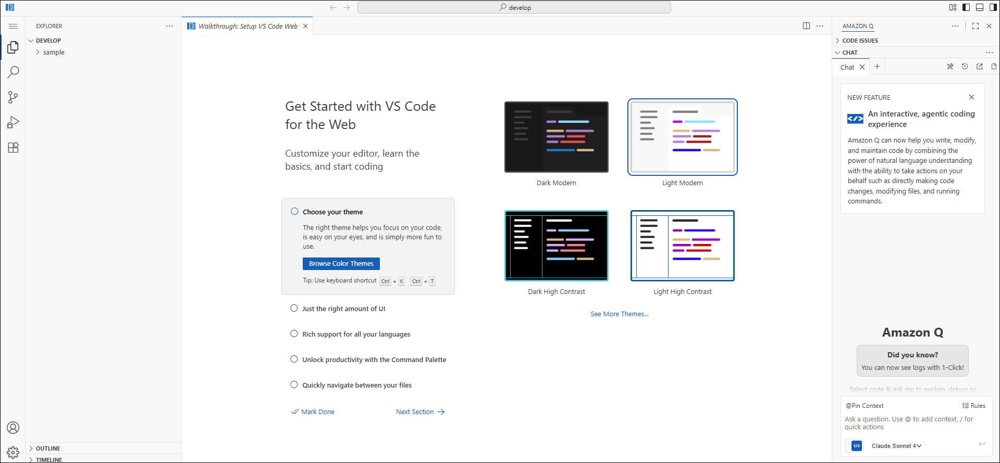
