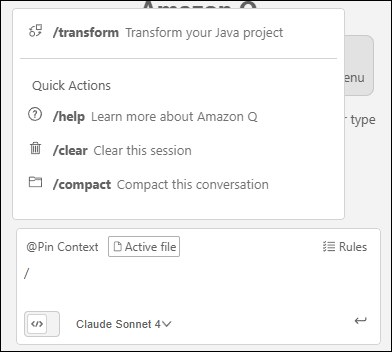
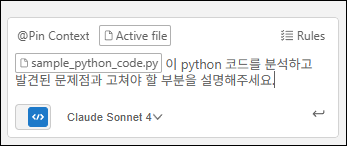

# Amazon Q Developer Chat

Amazon Q Developer의 Chat은 IDE 안에서 자연어로 질문하고 답변을 받아 개발 속도를 높여주는 기능입니다. 코드 이해, 오류 원인 파악, 간단한 코드 제안과 문서화 등 일상적인 개발 흐름을 빠르게 도와줍니다.

이 작업에서는 전반적인 생성형 AI 기반 Chat의 특징과, 바로 활용할 수 있는 간단 프롬프트 예시를 소개합니다.

## Act 1: Amazon Q 채팅 활성화
  1. Code-Server Extension에서 Q를 열면 "+ New tab" 버튼이 표시됩니다. "+ New tab" 버튼을 클릭하여 새 채팅을 시작합니다.
    

  2. Q Chat 하단에 Agentic 토글을 비활성화합니다. 해당 기능은 다음 작업에서 사용할 예정입니다.
    


## Act 2: Amazon Q 기능 확인하기
  1. 채팅에서 "@Pin Context"버튼을 클릭하거나 "@"를 입력하여 컨텍스트 기능을 표시합니다.

    !!! note
        @Pin Context로 Context를 등록하면 매 채팅마다 자동으로 등록된 Context를 참고하여 응답을 생성합니다.
        
    
    해당 기능을 사용하여 AI가 컨텍스트 내용을 참고하여 정확한 응답을 할 수 있도록 합니다.

    

    - @workspace: 프로젝트의 워크스페이스를 답변의 컨텍스트로 사용합니다.
    - Folders: 현재 프로젝트의 폴더 목록을 표시하고 선택한 폴더를 답변의 컨텍스트로 사용합니다.
    - Files: 현재 프로젝트의 파일 목록을 표시하고 선택한 파일을 답변의 컨텍스트로 사용합니다.
    - Code: 현재 프로젝트의 클래스, 함수, 글로벌 변수 목록을 표시하고 선택 항목을 답변의 컨텍스트로 사용합니다.
    - Prompts: 저장한 프롬프트 목록을 표시하고 선택한 프롬프트를 답변의 컨텍스트로 사용합니다.
    - Image: 프롬프트의 컨텍스트로 이미지를 추가할 수 있습니다.
    <br>
  
  2. 채팅에서 "/"를 입력하여 사용할 수 있는 명령어를 표시합니다.
    
    

    - ```/transform```: 이 명령을 사용하여 전체 프로젝트의 코드 언어 버전을 업데이트합니다. (해당 명령은 현재 Java만 지원하므로 이 실습에서 사용하지 않습니다.)
    - ```/help```: 이 명령을 사용하여 Amazon Q가 수행할 수 있는 작업과 수행할 수 없는 작업의 개요, 예시 질문 및 빠른 명령에 대한 개요를 볼 수 있습니다.
    - ```/clear```: 이 명령을 사용하여 현재 대화를 지웁니다. 채팅 패널에서 이전 대화를 모두 제거하고 Amazon Q가 이전 대화에 대해 가지고 있는 컨텍스트를 지웁니다.
    - ```/compact```: 컨텍스트 창이 용량 제한에 가까워지면 이 명령을 사용하여 채팅 기록을 압축합니다.

## Act 3: 채팅 활용하기
  Amazon Q는 AWS 서비스 및 소프트웨어 개발에 대한 질문에 답변할 수 있습니다.

  1. 웹 애플리케이션 배포 방법 질문하기

    아래 내용으로 Amazon Q 채팅에 질문합니다.

    ```
    Python Streamlit으로 개발된 웹 애플리케이션을 AWS로 배포하는 방법을 알려주세요.
    ```
    
    Amazon Q가 해당 질문에 대해 어떻게 분석하고 응답하는지 확인합니다.
    
    <br>
  
  2. 코드 분석 요청하기
    
    Context로 ```sample/sample_python_code.py```를 추가하고, 아래 내용으로 Amazon Q 채팅에 질문합니다.
    


    ```
    이 python 코드를 분석하고 발견된 문제점과 고쳐야 할 부분을 설명해주세요.
    ```

    Amazon Q가 해당 질문에 대해 어떻게 분석하고 응답하는지 확인합니다.
    

## 요약

  이 워크숍 활동에서 다음 항목을 실습했습니다.

  - ✅ Amazon Q 채팅 활성화
  - ✅ Amazon Q 채팅 에이전틱 활성화/비활성화
  - ✅ ```@``` 를 사용하여 Context 추가 확인
  - ✅ ```/``` 를 사용하여 Amazon Q 지원 기능 확인
  - ✅ Amazon Q에 질문하기
  - ✅ Amazon Q에 코드 분석 요청하기

  다음 활동에서는 Amazon Q의 Agent 기능을 실습해볼 것입니다.