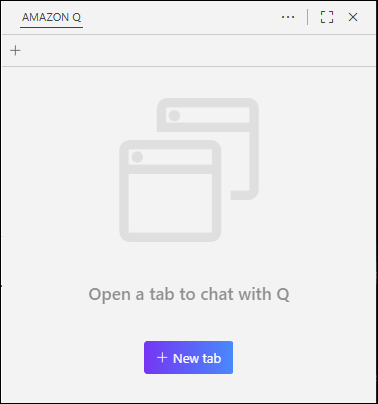
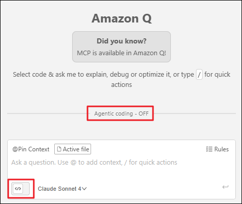
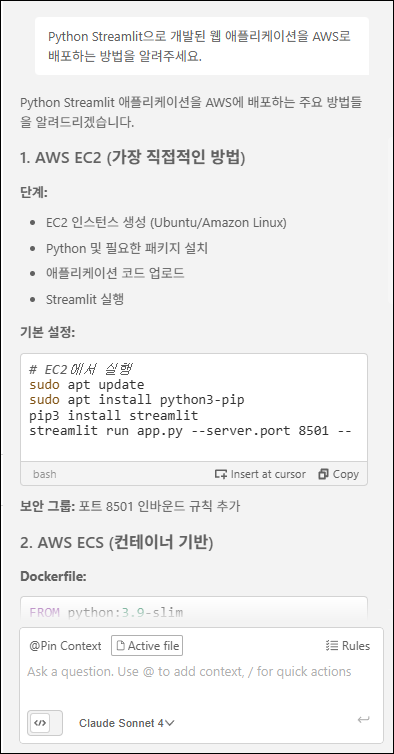
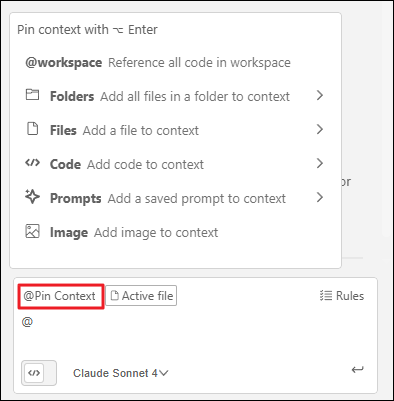
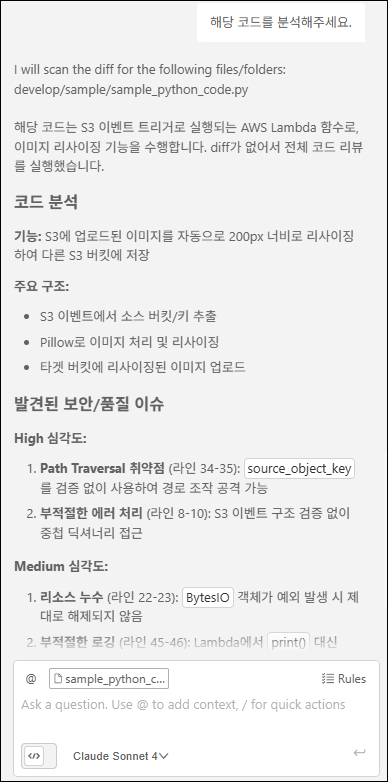

# Task 1: Chat

Amazon Q Developer의 **Chat** 기능은 IDE 안에서 자연어로 질문하고 답변을 받아 개발 속도를 높여주는 대화형 AI 어시스턴트입니다. 코드 이해, 버그 원인 파악, 코드 생성, 리팩토링 제안, 문서화 등 일상적인 개발 작업을 빠르고 효율적으로 지원합니다.

이 실습에서는 Amazon Q Developer Chat의 핵심 기능을 체험하고, 효과적인 프롬프트 작성 방법과 컨텍스트 활용 전략을 학습합니다.

---

## 🎯 학습 목표

이 실습을 완료하면 다음을 수행할 수 있습니다:

- Amazon Q Developer Chat 인터페이스를 활성화하고 사용하기
- 효과적인 프롬프트를 작성하여 정확한 답변 얻기
- `@` 기호를 활용하여 파일, 폴더, 코드를 컨텍스트로 추가하기
- 코드 분석 및 리뷰 요청으로 코드 품질 개선하기

---

## Act 1: Amazon Q Chat 시작하기

### 1-1. 새 채팅 세션 열기

   1. VS Code 좌측 사이드바에서 **Amazon Q** 아이콘을 클릭합니다.
   2. Q Developer 패널 상단의 **"+ New tab"** 버튼을 클릭하여 새 채팅 세션을 시작합니다.

      

### 1-2. Chat 모드 설정하기

   1. Q Chat 패널 하단의 **"Agentic"** 토글을 **비활성화**합니다.
      
      
    !!! info "Chat vs Agent 모드"
        - **Chat 모드**: 질문-답변 형식의 대화형 상호작용을 제공합니다. 코드 설명, 기술 문서 조회, 간단한 코드 생성에 적합합니다.
        - **Agent 모드**: 파일을 읽고 쓰며 복잡한 다중 단계 작업을 자율적으로 수행합니다. 다음 실습에서 자세히 다룹니다.

---

## Act 2: 효과적인 프롬프트로 질문하기

### 2-1. 명확하고 구체적인 질문하기

   - Amazon Q Developer는 AWS 서비스, 소프트웨어 개발, 프로그래밍 언어, 프레임워크에 대한 광범위한 지식을 보유하고 있습니다. 더 나은 답변을 얻기 위해서는 **구체적이고 명확한** 질문이 중요합니다.

   - **효과적인 프롬프트 작성 원칙:**

      - ✅ **구체적으로 질문하기**: 버전, 프레임워크, 기술 스택을 명시하세요.
      - ✅ **원하는 출력 형식 지정하기**: 코드 예제, 단계별 가이드, 아키텍처 다이어그램 등을 명확히 요청하세요.
      - ✅ **충분한 컨텍스트 제공하기**: 프로젝트 요구사항, 제약 조건, 목표를 설명하세요.
      - ❌ **피해야 할 프롬프트**: 모호하거나 너무 광범위한 질문

### 2-2. 실습: AWS 관련 질문하기

   1. 아래 예시 프롬프트를 사용하거나, 자신만의 질문을 입력해보세요.

    ??? quote "예시 프롬프트"
         ```
         AWS Bedrock 서비스와 연동되는 간단한 웹 애플리케이션을 구축하려고 합니다.
         효율적인 개발을 위해 권장되는 기술 스택(AWS 서비스, 프론트엔드/백엔드 프레임워크, 인증 및 배포 구성 포함)을 구체적으로 알려주세요.
         ```

   2. **Amazon Q가 제공하는 답변 확인하기:**

    ??? example "예시 응답"
         


      - 답변의 구조와 논리성을 평가하세요.
      - 참고한 출처나 AWS 문서 링크가 포함되어 있는지 확인하세요.
      - 추가 질문이 필요하다면 **대화 기록을 유지**하여 연속적으로 질문할 수 있습니다.


    !!! tip "프롬프트 개선 전략"
         **1. 퍼널링(Funneling): 넓은 질문에서 구체적인 질문으로**
         
         퍼널링은 처음에는 넓고 개방적인 질문으로 시작한 후, 점차 좁고 구체적인 질문으로 전환하는 기법입니다. 마치 깔때기(funnel)처럼 넓은 입구에서 좁은 출구로 흘러가듯, 대화를 구조화합니다.
         
         **퍼널링 실전 예시:**
         
         ```
         [1단계 - 넓은 질문]
         "Python으로 웹 애플리케이션을 만들고 싶어. 어떤 프레임워크를 추천해?"
         
         [2단계 - 범위 좁히기]
         "FastAPI를 선택했어. REST API를 구축할 때 필수적인 구성 요소는 뭐야?"
         
         [3단계 - 구체화]
         "FastAPI에서 JWT 인증을 구현하려고 해. 보안 모범 사례를 포함한 코드 예제를 보여줘."
         
         [4단계 - 세부 조정]
         "이 JWT 구현에서 토큰 만료 시간을 환경 변수로 관리하는 방법을 알려줘."
         ```
         
         이렇게 단계적으로 질문하면 Amazon Q가 맥락을 이해하고 더욱 정밀한 답변을 제공합니다.
         
         ---
         
         **2. 반복 개선: 첫 답변을 발판 삼아 개선하기**
         
         첫 답변이 만족스럽지 않다면 다음과 같이 요청을 명확히 하세요:
         
         - "더 자세한 예시를 제공해줘"
         - "코드 예제를 포함해줘"
         - "초보자도 이해할 수 있게 설명해줘"
         - "이 코드에 주석을 추가해서 다시 작성해줘"
         
         ---
         
         **3. 피드백 제공으로 답변 품질 향상**
         
         답변 하단의 👍/👎 버튼으로 피드백을 제공하면 향후 Amazon Q의 응답 품질이 개선됩니다.

---

## Act 3: Context를 활용한 정밀한 코드 분석

### 3-1. Context란?

   - **Context**는 AI가 참고할 수 있는 추가 정보(파일, 폴더, 코드 조각, 프롬프트 템플릿 등)입니다. 

   - Context를 제공하면:  
      - ✅ Amazon Q가 현재 프로젝트의 코드 구조와 패턴을 이해합니다.  
      - ✅ 프로젝트 특화된 정확한 답변과 코드 제안을 받을 수 있습니다.  
      - ✅ 여러 파일에 걸친 코드 관계를 파악하여 일관성 있는 코드를 생성합니다.  

### 3-2. Context 메뉴 살펴보기

   1. 채팅 입력창에서 **"@Pin Context"** 버튼을 클릭하거나 **"@"** 를 입력하여 컨텍스트 메뉴를 엽니다.

      

   2. 사용 가능한 Context 유형:

      | Context 유형 | 설명 |
      |------------|------|
      | **@workspace** | 전체 워크스페이스를 인덱싱하여 가장 관련성 높은 코드 조각을 자동으로 선택합니다. 대규모 프로젝트에서 특히 유용합니다. |
      | **Folders** | 특정 폴더의 모든 파일을 컨텍스트로 추가합니다. 모듈별로 집중된 답변을 받을 때 사용합니다. |
      | **Files** | 개별 파일을 컨텍스트로 추가합니다. 특정 파일에 대한 분석, 리팩토링, 버그 수정 시 유용합니다. |
      | **Code** | 클래스, 함수, 글로벌 변수를 직접 선택하여 컨텍스트로 추가합니다. 함수 단위 분석 시 효과적입니다. |
      | **Prompts** | 저장된 프롬프트 템플릿을 재사용합니다. 반복적인 작업 패턴을 효율화합니다. |
      | **Image** | 스크린샷, 다이어그램, UI 모형을 추가하여 시각적 컨텍스트를 제공합니다. |

    !!! note "@Pin Context 기능"
         **@Pin Context**로 Context를 등록하면, 해당 채팅 세션에서 **모든 질문에 자동으로 적용**됩니다. 동일한 파일이나 폴더를 반복적으로 참조할 때 매우 유용합니다.

### 3-3. 실습: 코드 분석 및 리뷰 요청하기
   1. **Context 추가하기:**  
      - `@` 를 입력한 후 **Files** 메뉴에서 `sample/sample_python_code.py` 파일을 선택합니다.
      - 선택한 파일이 입력창 상단에 태그로 표시되는지 확인합니다.  
      <br>
   2. **코드 분석 및 리뷰 요청하기:**  

    ??? quote "예시 프롬프트"
         ```
         이 Python 코드를 분석하고 발견된 문제점과 개선 방법을 구체적으로 설명해주세요.
         ```

   3. **Amazon Q의 답변 확인하기:**

    ??? example "예시 응답"
         

      Amazon Q는 다음과 같은 분석을 제공합니다:
      
      - 🐛 **버그 및 논리 오류**: 잠재적인 런타임 에러, 엣지 케이스 누락
      - 🔒 **보안 취약점**: SQL 인젝션, XSS, 하드코딩된 비밀번호
      - ⚡ **성능 최적화**: 비효율적인 알고리즘, 불필요한 루프
      - 📐 **코드 스멜**: 중복 코드, 네이밍 컨벤션 위반, 복잡한 중첩 구조
      - 💡 **개선 제안**: 리팩토링 방법, 모범 사례 적용

---

## 💡 추가 활용 팁

### 대화 히스토리 활용하기

   - Amazon Q는 **대화 기록을 유지**하므로, 이전 질문의 컨텍스트를 기억합니다. 이를 활용하여:

      - "방금 제안한 코드를 TypeScript로 변환해줘"
      - "이전 답변을 좀 더 간결하게 요약해줘"
      - "같은 로직을 Flask가 아닌 FastAPI로 구현해줘"

      와 같은 연속적인 질문이 가능합니다.

### 대화 초기화하기

   - 대화가 주제에서 벗어났거나 새로운 주제로 전환하고 싶다면:
      - 입력창에 `/clear` 명령어를 입력하여 대화 기록을 초기화하거나, 새 채팅창을 활성화하세요.

---

## ✅ 요약

이 워크숍 활동에서 다음 항목을 실습했습니다:

- ✅ Amazon Q Developer Chat 인터페이스 활성화 및 설정
- ✅ 효과적인 프롬프트 작성 원칙 학습 및 적용
- ✅ 퍼널링 기법을 활용한 점진적 질문 전략 이해
- ✅ `@` Context 메뉴를 활용한 파일 및 코드 참조
- ✅ 코드 분석 및 리뷰 요청으로 코드 품질 개선
- ✅ 대화 히스토리를 활용한 연속적인 질문 기법

---

## 🚀 다음 단계

다음 실습에서는 Amazon Q Developer의 **Agent 모드**를 활성화하여 다음과 같은 고급 기능을 체험합니다:

- 자율적인 파일 읽기/쓰기 및 파일 편집
- 변경 사항 되돌리기
- 문서 생성 요청

**준비되셨다면 다음 실습으로 이동하세요!** 🎉
