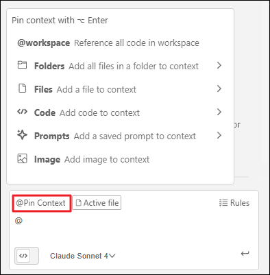

# Amazon Q Developer Chat

Amazon Q Developer의 Chat은 IDE 안에서 자연어로 질문하고 답변을 받아 개발 속도를 높여주는 기능입니다. 코드 이해, 오류 원인 파악, 간단한 코드 제안과 문서화 등 일상적인 개발 흐름을 빠르게 도와줍니다.

이 작업에서는 전반적인 생성형 AI 기반 Chat의 특징과, 바로 활용할 수 있는 간단 프롬프트 예시를 소개합니다.

## Act 1: Amazon Q 채팅 활성화
  1. Code-Server Extension에서 Q를 열면 "+ New tab" 버튼이 표시됩니다. "+ New tab" 버튼을 클릭하여 새 채팅을 시작합니다.
    

  2. Q Chat 하단에 Agentic 토글을 비활성화합니다. 해당 기능은 다음 작업에서 사용할 예정입니다.
    


## Act 2: 채팅 활용하기
  Amazon Q는 AWS 서비스 및 소프트웨어 개발에 대한 질문에 답변할 수 있습니다.

  1. AWS와 관련되거나 궁금한 사항을 질문해보세요.

    ??? quote "예시 프롬프트"
        ```
        AWS Bedrock 서비스와 연동되는 간단한 웹 애플리케이션을 구축하려고 합니다.
        효율적인 개발을 위해 권장되는 기술 스택(AWS 서비스, 프론트엔드/백엔드 프레임워크, 인증 및 배포 구성 포함)을 구체적으로 알려주세요.
        ```
    
  2. Amazon Q가 질문에 대해 어떻게 분석하고 응답하는지 확인합니다.

    
    <br>

## Act 3: Context 활용하여 채팅하기
  Context는 대화나 코드, 문서 등 AI가 참고할 수 있는 추가 정보입니다.

  이를 활용하면 AI가 단순히 입력된 문장만이 아니라, 주어진 상황과 배경(Context)을 함께 고려하여 보다 정확하고 일관된 응답을 생성할 수 있습니다.  

  1. 채팅에서 "@Pin Context"버튼을 클릭하거나 "@"를 입력하여 컨텍스트 기능을 표시합니다.

    !!! note
        @Pin Context로 Context를 등록하면 매 채팅마다 자동으로 등록된 Context를 참고하여 응답을 생성합니다.

    

    - @workspace: 프로젝트의 워크스페이스를 답변의 컨텍스트로 사용합니다.
    - Folders: 현재 프로젝트의 폴더 목록을 표시하고 선택한 폴더를 답변의 컨텍스트로 사용합니다.
    - Files: 현재 프로젝트의 파일 목록을 표시하고 선택한 파일을 답변의 컨텍스트로 사용합니다.
    - Code: 현재 프로젝트의 클래스, 함수, 글로벌 변수 목록을 표시하고 선택 항목을 답변의 컨텍스트로 사용합니다.
    - Prompts: 저장한 프롬프트 목록을 표시하고 선택한 프롬프트를 답변의 컨텍스트로 사용합니다.
    - Image: 프롬프트의 컨텍스트로 이미지를 추가할 수 있습니다.
    <br>
  
  2. `sample/sample_python_code.py`를 Context로 추가하고, Amazon Q에 코드 리뷰를 요청합니다.

    ??? quote "예시 프롬프트"
        ```
        이 python 코드를 분석하고 발견된 문제점과 고쳐야 할 부분을 설명해주세요.
        ```
    <br>

  3. Amazon Q가 해당 질문에 대해 어떻게 분석하고 응답하는지 확인합니다.

    


## 요약

  이 워크숍 활동에서 다음 항목을 실습했습니다.

  - ✅ Amazon Q 채팅 활성화
  - ✅ Amazon Q에 질문하기
  - ✅ `@` 를 사용하여 Context 추가 확인
  - ✅ Amazon Q에 코드 분석 요청하기

  다음 활동에서는 Amazon Q의 Agent 기능을 실습해볼 것입니다.