# Task 1: Agent

Amazon Q Developer의 **Agent** 기능은 IDE 안에서 자연어 대화를 기반으로 **"계획(Plan) - 실행(Execute) - 검증(Review)"** 사이클을 자동화하는 자율형 AI 어시스턴트입니다. 단순한 코드 설명이나 제안을 넘어, 실제로 파일을 읽고 쓰며, 다중 파일에 걸친 복잡한 변경 사항을 자동으로 적용하고, 필요시 셸 명령을 실행할 수 있습니다.

Chat 모드와 달리 Agent는 **자율성(Autonomy)**을 갖추고 있어, 개발자의 최소한의 감독하에 복잡한 개발 작업을 완수할 수 있습니다. 모든 변경 사항은 diff 형태로 검토할 수 있으며, 원하지 않는 변경은 즉시 되돌릴 수 있습니다.

이 실습에서는 Agent의 핵심 기능인 **자율적 코드 수정**, **다중 파일 관리**, **자동 문서 생성**을 체험합니다.

---

## 🎯 학습 목표

이 실습을 완료하면 다음을 수행할 수 있습니다:

- Amazon Q Developer Agent 모드를 활성화하고 사용하기
- Agent의 자율적 순환 구조를 이해하고 작동 원리 파악하기
- Agent를 활용하여 코드 분석, 리팩토링, 보안 취약점 수정을 자동화하기
- 변경 사항을 diff 형식으로 검토하고 승인/거부하기
- Agent를 통해 프로젝트 문서(README.md)를 자동 생성하기
- 실수로 적용한 변경 사항을 Undo 기능으로 되돌리기

---

## 💡 Chat vs Agent: 언제 무엇을 사용할까?

   - #### Chat, Agent 비교 테이블

      | 특징 | Chat 모드 | Agent 모드 |
      |------|----------|-----------|
      | **자율성** | 답변만 제공, 파일 수정 불가 | 파일을 자동으로 읽고 쓰고 수정 |
      | **작업 범위** | 단일 질문-답변 | 다중 단계 워크플로우 자동 실행 |
      | **파일 변경** | 코드 제안만 제공 | 실제 파일에 변경 사항 적용 |
      | **적합한 작업** | 질문, 코드 설명, 간단한 제안 | 리팩토링, 기능 구현, 문서 생성, 버그 수정 |
      | **실행 시간** | 즉시 응답 | 수 초~수 분 소요 가능 |
      | **검토 필요성** | 낮음 | 높음 (모든 변경 사항 검토 필수) |

    !!! tip "Agent 모드 사용 시나리오"
         다음과 같은 경우 Agent 모드를 활성화하세요:
         
         - ✅ 여러 파일에 걸친 리팩토링이 필요할 때
         - ✅ 보안 취약점을 자동으로 수정하고 싶을 때
         - ✅ 전체 프로젝트 문서를 생성해야 할 때
         - ✅ 새로운 기능을 처음부터 구현해야 할 때
         - ✅ 단위 테스트를 자동 생성하고 싶을 때

---

## Act 1: Amazon Q Agent 활성화하기

### 1-1. 새 채팅 세션으로 시작하기

   - 이전 실습(Chat)의 대화 기록이 남아 있다면, 새로운 Agent 작업을 위해 **컨텍스트를 초기화**하는 것이 좋습니다.

      - 방법 1. `/clear` 명령어 사용

         1. 채팅 입력창에 `/clear`를 입력하고 Enter를 누릅니다.
         2. 대화 기록이 초기화되며, 새로운 주제로 대화를 시작할 수 있습니다.

      - 방법 2. 새 탭 열기

         1. Amazon Q 패널 상단의 **"+"** 버튼을 클릭하여 새 채팅 탭을 엽니다.

            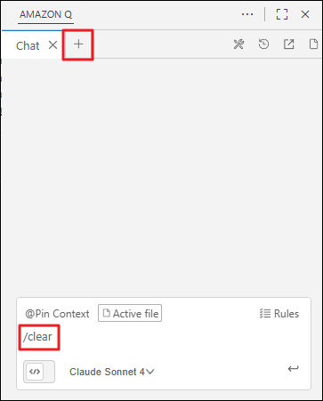

    !!! note "왜 새 채팅을 시작해야 하나요?"
         Amazon Q는 **활성화된 채팅의 전체 대화 기록**을 참고하여 응답을 생성합니다. 이전 대화의 컨텍스트가 누적되면:
         
         - 컨텍스트 용량을 초과하여 성능이 저하될 수 있습니다.
         - 이전 주제와 혼동되어 부정확한 답변을 받을 수 있습니다.
      
         **다른 주제로 전환하거나 새로운 작업을 시작할 때는 항상 새 채팅을 여는 것을 권장합니다.**

### 1-2. Agent 모드 활성화하기

   1. 채팅 패널 하단의 **"Agentic"** 토글을 **활성화**합니다.

      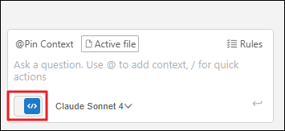

   2. 토글이 켜지면 Agent 모드가 활성화되며, 이제 Amazon Q가 파일을 자율적으로 읽고 쓸 수 있습니다.

    !!! warning "Agent 모드 사용 시 주의사항"
         Agent는 실제 파일에 변경 사항을 적용합니다. 다음 사항을 유념하세요:
         
         - ✅ 변경 사항이 발생하면, **diff를 반드시 검토**하세요.
         - ✅ 중요한 프로젝트에서는 **Git 커밋 후 사용**하거나 **백업을 유지**하세요.
         - ✅ Agent가 예상치 못한 방향으로 진행하면 **즉시 중단**할 수 있습니다.

---

## Act 2: 코드 분석 및 자동 리팩토링

### 2-1. Context 추가 및 리팩토링 요청하기

이번 실습에서는 보안 취약점과 코드 스멜이 포함된 Python 파일을 Agent가 자동으로 분석하고 리팩토링하도록 요청합니다.

   1. **Context 추가하기:**
      - 채팅 입력창에서 `@`를 입력한 후 **Files** 메뉴에서 `sample/sample_python_code.py`를 선택합니다.

   2. **코드 분석 및 리팩토링 요청 프롬프트 입력:**

    ??? quote "예시 프롬프트"
         ```
         이 Python 코드를 분석하고, 발견된 취약점을 설명한 뒤, 권장 코드 스타일과 모범 사례에 따라 리팩터링된 코드를 제시하고 변경해주세요.
         ```

   3. **Enter를 눌러 Agent 작업 시작:**

      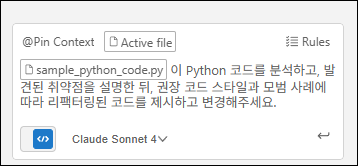

### 2-2. Agent의 작업 과정 관찰하기

  - Agent가 활성화되면 다음과 같은 단계를 자율적으로 수행합니다:

      **1. 분석(Analysis)**: 제공된 파일을 읽고 코드 구조, 로직, 잠재적 문제를 파악합니다.

      **2. 계획(Planning)**: 수정이 필요한 부분을 식별하고 리팩토링 전략을 수립합니다.

      **3. 실행(Execution)**: 파일을 열고 코드를 수정하며, 필요시 여러 파일에 걸쳐 변경 사항을 적용합니다.

      **4. 검증(Verification)**: 변경 사항이 요청을 충족하는지 내부적으로 검증합니다.

   - Agent의 작동 원리

      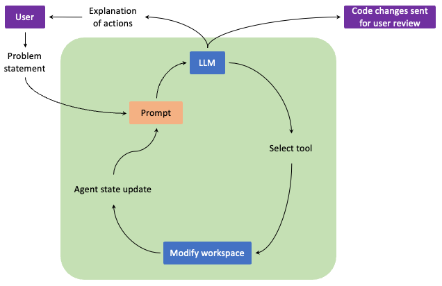

      Amazon Q Developer Agent는 위 다이어그램과 같이 **자율적인 순환 구조**로 작동합니다:

      **1.** **Problem statement (문제 제시)**: 사용자가 자연어로 해결할 문제나 작업을 제시합니다.

      **2.** **LLM (대규모 언어 모델)**: 

      - 사용자의 요청을 이해하고 분석합니다.
      - 현재 상태를 평가하고 다음에 취해야 할 행동을 결정합니다.
      - 필요한 도구를 선택합니다.

      **3.** **Select tool (도구 선택)**: 

      - 파일 읽기, 쓰기, 검색, 명령 실행 등 작업에 필요한 도구를 선택합니다.
      - 각 도구는 특정 목적에 최적화되어 있습니다.

      **4.** **Modify workspace (작업 공간 수정)**: 

      - 선택한 도구를 사용하여 실제 파일을 생성, 수정, 삭제합니다.
      - 코드 변경, 파일 이동, 구조 재편성 등을 수행합니다.

      **5.** **Agent state update (에이전트 상태 업데이트)**: 

      - 수정 결과를 Agent의 내부 상태에 반영합니다.
      - 무엇이 완료되었고 무엇이 남았는지 추적합니다.
      - 다음 단계 계획을 조정합니다.

      **6.** **Prompt (프롬프트 업데이트)**:

      - 새로운 정보와 현재 상태를 바탕으로 다음 LLM 호출을 위한 프롬프트를 생성합니다.
      - **순환 반복**: 목표가 달성될 때까지 2~6단계를 반복합니다.

  - 작업이 완료되면 Agent는 사용자에게:

      - ✅ **Explanation of actions (작업 설명)**: 수행한 모든 작업에 대한 상세한 설명을 제공합니다.
      - ✅ **Code changes sent for user review (코드 변경 검토 요청)**: 모든 변경 사항을 diff 형태로 제출합니다.

      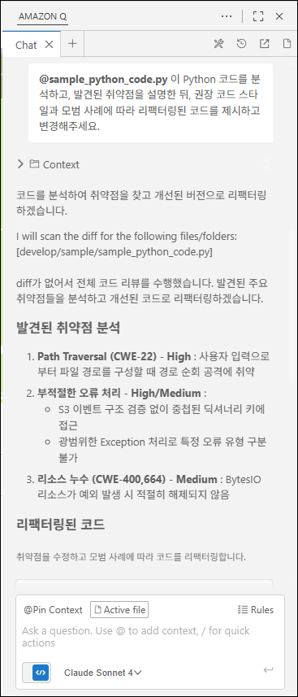

### 2-3. 변경 사항 검토하기

Agent가 작업을 완료하면 **수정된 파일 목록**이 채팅 패널에 표시됩니다.

   1. 수정된 파일 이름(예: `sample_python_code.py`)을 클릭합니다.

      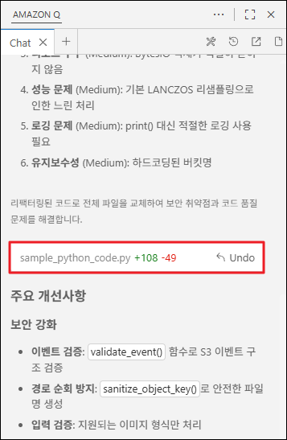


   2. VS Code의 diff 뷰가 열리며, **좌측(변경 전)**과 **우측(변경 후)**을 비교할 수 있습니다.

      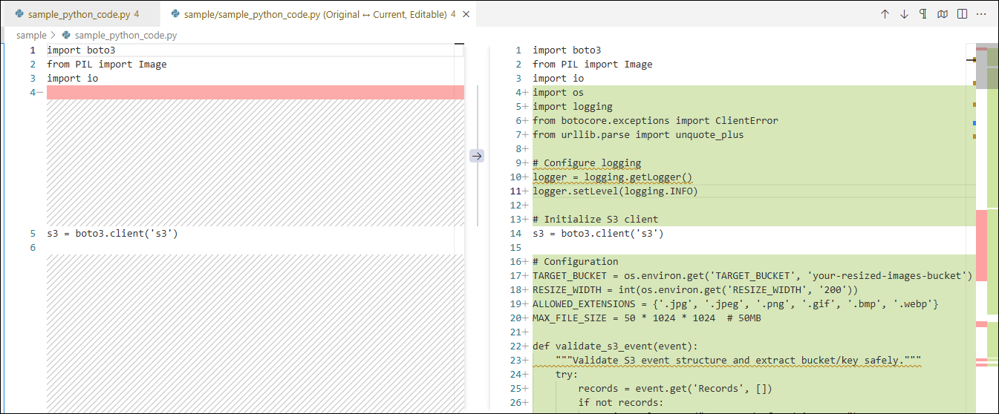

      - 🔴 **빨간색 줄**: 삭제된 코드
      - 🟢 **초록색 줄**: 추가된 코드

### 2-4. 변경 사항 승인 또는 되돌리기

   - **변경 사항을 승인하려면:**

      - 채팅 패널의 변경 사항을 검토한 후, 문제가 없으면 **자동으로 적용**됩니다.

   - **변경 사항을 되돌리려면:**  
      1. 채팅 패널에서 수정된 파일 우측의 **"Undo"** 버튼을 클릭합니다.
      2. 변경 사항이 즉시 롤백되어 이전 상태로 복원됩니다.

      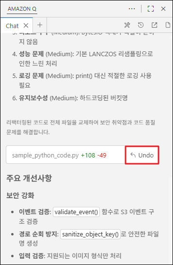

    !!! tip "Undo의 제한사항"
         - ✅ **작업 직후**: Undo 버튼을 통해 즉시 되돌릴 수 있습니다.
         - ❌ **파일을 직접 수정한 후**: Undo 기능이 작동하지 않을 수 있습니다.
         - ❌ **브라우저 세션이 끊기거나 Amazon Q 세션이 끊길 경우**: Undo 기능이 작동하지 않을 수 있습니다.
         - 🔄 **권장 사항**: 중요한 변경 전에는 Git 커밋을 생성하거나, 변경 사항을 수락하기 전에 철저히 검토하세요.

---

## Act 3: 프로젝트 문서 자동 생성

### 3-1. README.md 생성 요청하기

Amazon Q Developer의 Agent를 사용하여 **프로젝트에 대한 문서를 자동 생성**할 수 있습니다.

   1. **Context 추가:**
      - `@`를 입력하고 `sample/sample_python_code.py` 파일을 다시 선택합니다.

   2. **문서 생성 요청 프롬프트:**

    ??? quote "예시 프롬프트"
         ```
         이 Python 코드에 대한 README.md 파일을 sample 디렉토리에 생성해주세요.
         ```

   3. **Enter를 눌러 작업 시작:**

      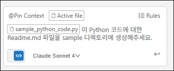

### 3-2. 생성된 문서 확인하기

Agent가 작업을 완료하면:

   1. 채팅 패널에 작업 내용을 확인합니다.
      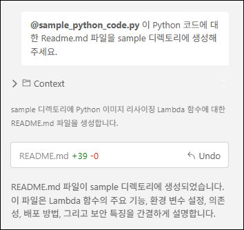

   2. 파일 이름을 클릭하여 생성된 문서를 확인합니다.

   3. **생성된 README.md는 다음을 포함할 수 있습니다:**

      - 📋 **프로젝트 개요**: 코드의 목적과 기능  
      - 🚀 **사용 방법**: 설치 및 실행 가이드  
      - 📂 **파일 구조**: 주요 모듈 및 함수 설명  
      - 🔧 **의존성**: 필요한 라이브러리 목록  
      - 📝 **예제 코드**: 사용법 시연

      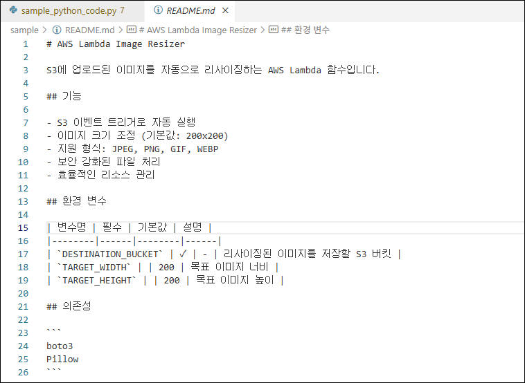

    !!! info "생성 결과의 다양성"
         생성되는 모든 응답, 파일, 코드는 **LLM의 특성상 매번 다를 수 있습니다**.  
         동일한 프롬프트를 반복해도 약간씩 다른 결과가 나올 수 있으며, 이는 정상적인 현상입니다.

---

## 🧹 리소스 정리

실습을 마친 후, 다음 워크숍을 위해 생성된 파일을 정리합니다.

   1. VS Code 좌측 사이드바에서 **탐색기(Explorer)** 아이콘을 클릭합니다.

   2. `sample` 디렉토리를 **우클릭**하고 **"Delete Permanently"**를 선택합니다.

      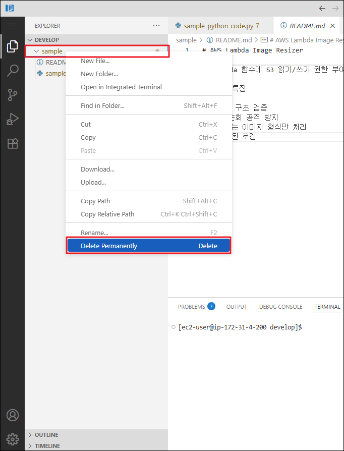

    !!! note "리소스 정리의 이유"
         이 정리 작업은 다음 실습부터 **불필요한 컨텍스트가 포함되지 않도록** 하기 위함입니다.

---

## 💡 Agent 활용 고급 팁
   1. 반복 개선 요청하기

      - Agent가 생성한 코드가 완벽하지 않다면, **추가 프롬프트**로 개선을 요청하세요:

    ??? quote "예시 프롬프트"
         ```
         방금 리팩토링한 코드에 타입 힌트(type hints)를 추가해줘.
         ```

         ```
         이 코드에 docstring을 추가하고, 예외 처리를 개선해줘.
         ```

   2. 여러 파일을 동시에 수정하기

      - Agent는 다중 파일 변경을 지원합니다:
    ??? quote "예시 프롬프트"
         ```
         @sample/sample_python_code.py에 각 기능별 주석을 추가하고, @sample/README.md에 상세 내용을 추가해줘
         ```

   3. Agent 작업 중단하기

      - Agent가 잘못된 방향으로 진행 중이라면:
         - **"Stop"** 버튼을 클릭하여 작업을 즉시 중단할 수 있습니다.  
         - 부분적으로 적용된 변경 사항(파일)은 Undo로 되돌릴 수 있습니다.

---

## ✅ 요약

이 워크숍 활동에서 다음 항목을 실습했습니다:

- ✅ Amazon Q Agent 모드 활성화 및 Chat 모드와의 차이점 이해
- ✅ Agent의 자율적 순환 구조(LLM → 도구 선택 → 작업 공간 수정 → 상태 업데이트 → 프롬프트 → 반복) 이해
- ✅ Agent를 통한 자율적 코드 분석 및 리팩토링
- ✅ Diff 뷰를 활용한 변경 사항 검토 및 승인 프로세스
- ✅ Undo 기능으로 실수로 적용한 변경 사항 되돌리기
- ✅ Agent를 통한 프로젝트 문서(README.md) 자동 생성
- ✅ 워크스페이스 정리를 통한 컨텍스트 최적화

---

## 🚀 다음 단계

다음 실습에서는 **Amazon Q Developer Rules** 기능을 탐색하여 다음을 학습합니다:

- 프로젝트별 코딩 표준 및 규칙 정의하기
- Agent와 Chat이 규칙을 자동으로 준수하도록 설정하기
- 팀 전체에 일관된 코드 스타일 적용하기

**Agent의 강력한 자동화 능력을 경험하셨나요? 이제 이를 제어하고 최적화하는 방법을 배워볼 차례입니다!** 🎉