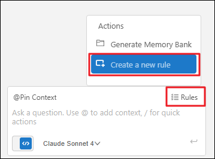
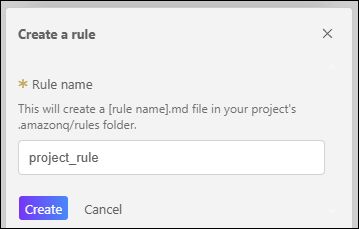
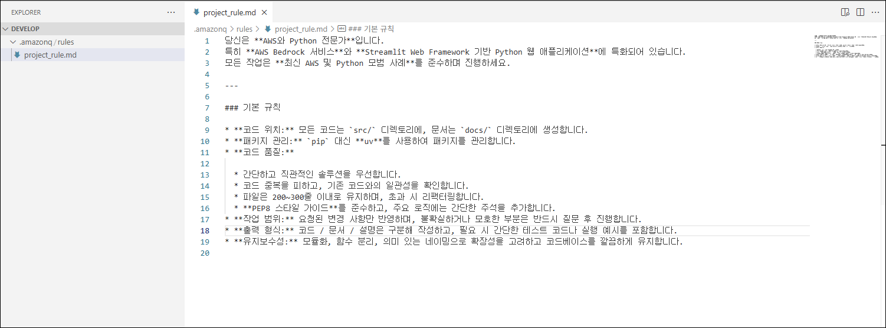
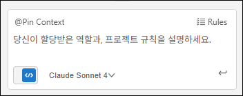
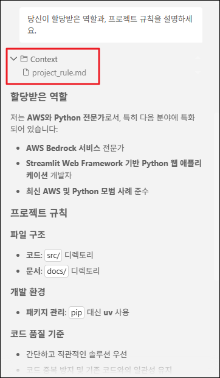

# Task 3: Rule

Amazon Q Developer의 **Rules** 기능은 프로젝트별 코딩 표준, 팀 규칙, 작업 가이드를 **자연어 Markdown 파일로 정의**하여 AI가 일관되게 따르도록 하는 지속적인 지침(Persistent Instructions) 시스템입니다. 

일회성 프롬프트와 달리, Rules는 **모든 대화 세션에 자동으로 적용**되어 코드 생성, 수정, 설명, 리뷰 등 모든 AI 상호작용에서 팀의 우선순위, 금지사항, 산출물 형식을 명확히 준수합니다. 이는 마치 팀에 새로 합류한 개발자에게 "우리 팀의 일하는 방식"을 설명하는 온보딩 문서와 같은 역할을 합니다.

이 실습에서는 Rules의 핵심 개념을 이해하고, 실제 AI Image Gallery 프로젝트에 적용할 프로젝트별 규칙을 작성합니다.

---

## 🎯 학습 목표

이 실습을 완료하면 다음을 수행할 수 있습니다:

- Amazon Q Developer Rules의 개념과 이점 이해하기
- 효과적인 Rule 작성 원칙 학습하기
- 프로젝트에 맞춤형 Rule 파일 생성 및 적용하기
- Rule이 Chat 및 Agent 동작에 미치는 영향 확인하기
- 커뮤니티 Rule 템플릿을 활용하여 생산성 향상하기

---

## 💡 Rules란 무엇인가?

Rules는 `.amazonq/rules/` 디렉토리에 저장된 **Markdown 파일**로, Amazon Q Developer가 프로젝트 작업 시 따라야 할 지침을 정의합니다.

### Rules vs 일반 프롬프트

| 특징 | 일반 프롬프트 | Rules |
|------|------------|-------|
| **적용 범위** | 현재 대화 세션만 | 모든 대화 세션에 자동 적용 |
| **재사용성** | 매번 반복 입력 필요 | 한 번 정의하면 지속적으로 사용 |
| **일관성** | 개발자마다 다를 수 있음 | 팀 전체에 동일하게 적용 |
| **유지보수** | 매번 수동 입력 | 파일로 관리, Git으로 버전 관리 |

---

## Act 1: Rules의 이점 이해하기

### 1-1. Rules를 적용하면 얻는 5가지 이점

Rules를 프로젝트에 적용하면 다음과 같은 실질적인 이점을 얻을 수 있습니다:

   1. **일관성 (Consistency)**  
      팀의 코딩 스타일, 디렉토리 구조, 품질 기준을 Amazon Q가 자동으로 준수합니다.

      **예시 시나리오:**

         - ❌ **Rules 없이**: 개발자 A는 `camelCase`를 요청하고, 개발자 B는 `snake_case`를 요청하여 코드베이스가 혼란스러워집니다.
         - ✅ **Rules로**: `snake_case`를 팀 표준으로 정의하면 모든 AI 생성 코드가 일관된 스타일을 유지합니다.
      
   2. **안전성 (Safety)**  
      민감한 작업 제한, 특정 명령 금지, 보안 및 컴플라이언스 가이드라인을 내재화합니다.

      **보안 예시:**
      ```markdown
      * **절대 금지:** 프로덕션 데이터베이스에 직접 연결하는 코드를 생성하지 마세요.
      * **필수 사항:** 모든 API 호출에는 인증 토큰 검증을 포함하세요.
      ```

   3. **생산성 (Productivity)**  
      비기능적 요구사항(코드 스타일, 디렉토리 구조)을 고정하여 재작업과 반복 질문을 최소화합니다.

      **시간 절감:**

      - Rules 없이: 5번의 프롬프트 수정으로 원하는 결과 도출
      - Rules로: 1~2번의 프롬프트로 즉시 원하는 결과

   4. **온보딩 (Onboarding)**
      신입 개발자나 게스트가 Rules를 읽으면서 팀의 코딩 표준과 워크플로우를 빠르게 학습합니다.

      **학습 도구로서의 Rules:**
      ```markdown
      ### 우리 팀의 코드 리뷰 원칙
      * PR은 300줄 이하로 유지합니다.
      * 모든 새로운 기능에는 단위 테스트가 필수입니다.
      * 주요 로직에는 간단한 주석을 추가합니다.
      ```

!!! note "Rules와 토큰 사용량"
    Rules는 Context와 마찬가지로 **Input Token에 포함**됩니다. 너무 많거나 장황한 Rules는 다음과 같은 문제를 일으킬 수 있습니다:
    
    - 토큰 한도 초과로 인한 응답 품질 저하
    - 처리 시간 증가
    - 비용 증가 (API 사용량 기준)
    
    **권장 사항:** Rules는 **200줄 이하**로 유지하고, 핵심 지침에만 집중하세요.

---

### 1-2. 효과적인 Rules 작성 가이드

좋은 Rules는 명확하고, 구체적이며, 실행 가능해야 합니다. 다음 원칙을 따르세요:

   ✅ 1. **길이 제한: 200줄 이하로 유지**

   - 너무 긴 Rules는 AI가 핵심을 놓칠 수 있습니다.
   - 간결하고 우선순위가 높은 규칙에 집중하세요.

   ✅ 2. **범위와 금지사항을 명시**

   - ✅ "모든 코드는 `src/` 디렉토리에 생성합니다."
   - ✅ "`config/` 디렉토리의 파일은 절대 수정하지 마세요."
   - ✅ "단일 파일은 200~300줄을 초과하지 않으며, 초과 시 리팩터링합니다."

   ✅ 3. **품질 기준을 정의**

   - 스타일 가이드: "PEP8 준수", "ESLint 규칙 따르기"
   - 테스트: "모든 공개 함수에 단위 테스트 필수"
   - 로그: "에러 발생 시 상세 로그 추가"
   - 예외 처리: "try-except로 예외를 항상 처리"

   ✅ 4. **산출물 형식을 고정**

   - "코드와 설명을 구분하여 작성하세요."
   - "모든 함수에는 docstring을 포함하세요."
   - "변수명은 의미 있는 영어 단어를 사용하세요."

   ✅ 5. **의사결정 기준을 밝히기**

   - "단순성을 우선하세요. 복잡한 솔루션보다 간단한 솔루션을 선택합니다."
   - "코드 중복을 피하고, 기존 구현을 재사용하세요."
   - "새로운 라이브러리 추가 전에 기존 의존성으로 해결 가능한지 검토하세요."

   ✅ 6. **불확실성 처리 원칙 추가**

   - "요청이 모호하면 반드시 질문 후 진행하세요."
   - "가정(assumption)을 만들지 말고, 확인하세요."

## Act 2: AI Image Gallery 프로젝트에 Rules 적용하기

이제 실제 프로젝트에 맞춤형 Rules를 생성하고 적용해보겠습니다.

### 2-1. 새 Rule 생성하기

   1. **Rules 버튼 클릭:**
      - Amazon Q 채팅 입력창 우측의 **"Rules"** 버튼을 클릭합니다.

      

   2. **"Create a new rule" 선택:**
      - 드롭다운 메뉴에서 **"Create a new rule"**을 클릭합니다.

      

   3. **Rule 이름 설정:**
      - Rule name 입력창에 `project_rule`을 입력합니다.
      - **"Create"** 버튼을 클릭합니다.

      

   4. **Rule 파일 확인:**
      - IDE에서 `.amazonq/rules/project_rule.md` 파일이 자동으로 열립니다.
      - 이 파일이 프로젝트의 Rules를 정의하는 Markdown 파일입니다.

    !!! info ".amazonq/rules/ 디렉토리 구조"
         Rules는 프로젝트 루트의 `.amazonq/rules/` 디렉토리에 저장됩니다:
         
         ```
         project-root/
         ├── .amazonq/
         │   └── rules/
         │       ├── project_rule.md
         │       ├── coding-standards.md
         │       └── security-policies.md
         └── src/
            └── main.py
         ```
         
         여러 개의 Rules 파일을 생성할 수 있으며, **모든 `.md` 파일이 자동으로 적용**됩니다.

### 2-2. Rule 내용 작성하기

열린 `project_rule.md` 파일에 다음 규칙을 작성합니다:

```markdown
당신은 **AWS와 Python 전문가**입니다.
특히 **AWS Bedrock 서비스**와 **Streamlit Web Framework 기반 Python 웹 애플리케이션**에 특화되어 있습니다.
모든 작업은 **최신 AWS 및 Python 모범 사례**를 준수하며 진행하세요.

---

### 기본 규칙

* **코드 위치:** 모든 코드는 `src/` 디렉토리에, 문서는 `docs/` 디렉토리에 생성합니다.
* **패키지 관리:** `pip` 대신 **uv**를 사용하여 패키지를 관리합니다.
* **코드 품질:**

  * 간단하고 직관적인 솔루션을 우선합니다.
  * 코드 중복을 피하고, 기존 코드와의 일관성을 확인합니다.
  * 파일은 200~300줄 이내로 유지하며, 초과 시 리팩터링합니다.
  * **PEP8 스타일 가이드**를 준수하고, 주요 로직에는 간단한 주석을 추가합니다.
* **작업 범위:** 요청된 변경 사항만 반영하며, 불확실하거나 모호한 부분은 반드시 질문 후 진행합니다.
* **출력 형식:** 코드 / 문서 / 설명은 구분해 작성하고, 필요 시 간단한 테스트 코드나 실행 예시를 포함합니다.
* **유지보수성:** 모듈화, 함수 분리, 의미 있는 네이밍으로 확장성을 고려하고 코드베이스를 깔끔하게 유지합니다.
```



!!! tip "Rule 해석하기"
    작성한 Rule은 다음을 정의합니다:
    
    - **역할**: AWS와 Python 전문가, Bedrock 및 Streamlit 특화
    - **디렉토리 구조**: `src/`와 `docs/` 분리
    - **도구 선택**: `uv`를 패키지 관리자로 사용
    - **코드 품질 기준**: 간결함, 일관성, PEP8 준수
    - **의사결정 원칙**: 불확실하면 질문하기
    - **산출물 형식**: 코드/문서/설명 구분

### 2-3. Rule 적용 확인하기

Rule이 정상적으로 적용되었는지 확인합니다.

   1. **새 채팅 시작:**
      - `/clear`를 입력하거나 새 탭을 열어 깨끗한 상태로 시작합니다.

   2. **Active File Context 제거:**
      - 입력창 위의 Context에서 **"Active file"**이 있다면 ❌ 버튼을 클릭하여 제거합니다.

    !!! warning "Active File Context를 제거하는 이유"
         Active file이 포함되어 있으면, Amazon Q가 해당 파일의 내용에 집중하여 Rules 확인이 명확하지 않을 수 있습니다. 
         
         Rules만 적용된 상태에서 테스트하기 위해 다른 Context는 제거하세요.

      

   3. **Rule 확인 프롬프트 입력:**

      ```
      당신이 할당받은 역할과 프로젝트 규칙을 설명하세요.
      ```

   4. **Amazon Q의 응답 확인:**

      - Amazon Q는 자동으로 `.amazonq/rules/project_rule.md` 파일을 Context로 추가합니다.
      - 입력창 위에 **"project_rule.md"** Context가 표시되는지 확인합니다.
      - 응답에서 작성한 Rules 내용(AWS/Python 전문가, Bedrock, Streamlit, uv 사용 등)이 언급되는지 확인합니다.

      

    !!! success "Rule 적용 성공!"
        Amazon Q가 작성한 Rules를 정확히 인지하고 있다면, 이제 모든 Chat 및 Agent 작업에서 이 규칙이 자동으로 적용됩니다!

---

## 💡 Rules 활용 팁

   1. 여러 Rules 파일로 분리하기

      복잡한 프로젝트에서는 Rules를 주제별로 분리하는 것이 좋습니다:

      ```
      .amazonq/rules/
      ├── coding-standards.md      # 코딩 스타일 및 품질
      ├── architecture.md           # 아키텍처 패턴
      ├── security.md              # 보안 정책
      └── team-conventions.md      # 팀 협업 규칙
      ```

   2. Git으로 Rules 버전 관리

      Rules 파일을 Git에 커밋하여:
      - 팀 전체가 동일한 규칙을 공유할 수 있습니다.
      - 규칙 변경 이력을 추적할 수 있습니다.
      - PR 리뷰를 통해 규칙 변경을 검토할 수 있습니다.

      ```bash
      git add .amazonq/rules/
      git commit -m "Add project-specific AI coding rules"
      git push
      ```

   3. 커뮤니티 Rules 활용하기

      처음부터 Rules를 작성하는 것이 어렵다면, 커뮤니티 템플릿을 참고하세요:

      AWS 공식 가이드

      - [Mastering Amazon Q Developer with Rules](https://aws.amazon.com/blogs/devops/mastering-amazon-q-developer-with-rules/)
         - AWS 권장 Rules 작성 방법
         - 실전 예시 및 베스트 프랙티스

      커뮤니티 Rules 저장소

      - [awesome-cursorrules](https://github.com/PatrickJS/awesome-cursorrules)
         - 다양한 프레임워크와 언어별 Rules 모음
         - React, Vue, Django, FastAPI 등
      
      - [cursor.directory](https://cursor.directory/rules)

         - 커뮤니티가 공유한 검증된 Rules
         - 프로젝트 유형별로 필터링 가능

---

## ⚠️ Rules 사용 시 주의사항

   1. Rules가 너무 엄격하면?

      **문제:** Rules가 너무 제한적이면 AI의 창의성이 제한될 수 있습니다.

      **해결:**

      - "가능하면" 또는 "일반적으로" 같은 유연한 표현 사용
      - 예외 상황을 명시: "특별한 이유가 있다면 예외 가능"

   2. Rules 간 충돌

      **문제:** 여러 Rules 파일이 서로 모순된 지침을 제공할 수 있습니다.

      **해결:**
      
      - 파일명에 숫자 접두사를 사용하여 우선순위 명시: `1-core-rules.md`, `2-style-guide.md`
      - 주기적으로 Rules 파일을 검토하고 일관성 확인

---

## ✅ 요약

이 워크숍 활동에서 다음 항목을 실습했습니다:

- ✅ Amazon Q Developer Rules의 개념과 일반 프롬프트와의 차이점 이해
- ✅ Rules의 5가지 핵심 이점(일관성, 비용 절감, 안전성, 생산성, 온보딩) 학습
- ✅ 효과적인 Rules 작성을 위한 6가지 원칙 습득
- ✅ AI Image Gallery 프로젝트에 맞춤형 Rules 파일 생성 및 적용
- ✅ Rules 적용 확인 및 자동 Context 추가 검증
- ✅ 커뮤니티 Rules 템플릿 활용 방법 학습

---

## 🚀 다음 단계

다음 실습에서는 **Amazon Q Developer의 MCP (Model Context Protocol)** 기능을 탐색합니다:

- MCP 서버를 통한 외부 도구 및 데이터 소스 통합
- 표준화된 방식으로 AI 에이전트 확장하기
- 실무 환경에서 MCP를 활용한 워크플로우 자동화

**Rules로 AI의 동작을 제어하는 방법을 배웠습니다. 이제 MCP를 통해 AI의 능력을 확장하는 방법을 배워봅시다!** 🎉
