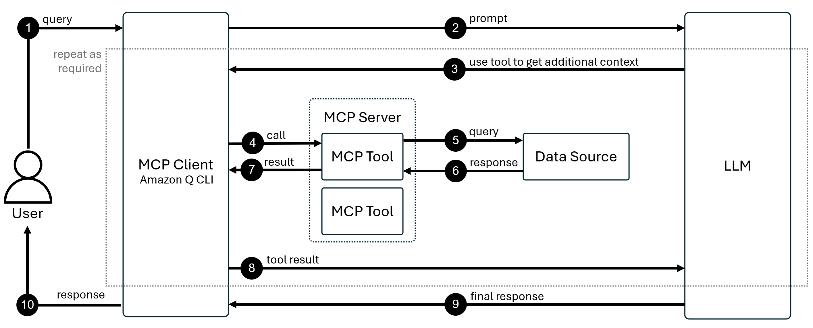

# Task 4: MCP

Amazon Q Developer의 **MCP (Model Context Protocol)** 기능은 AI 어시스턴트가 외부 도구와 데이터 소스에 접근할 수 있도록 하는 표준화된 프로토콜입니다. MCP를 사용하면 Amazon Q가 최신 AWS 문서, 코드 샘플, 사내 지식베이스 등 실시간 정보에 접근하여 더 정확한 답변을 제공할 수 있습니다.

이전 실습에서 배운 **Rules**가 AI의 동작을 제어했다면, **MCP**는 AI의 능력을 확장합니다.

이 실습에서는 AWS Knowledge MCP 서버를 설정하고, Rules와 결합하여 자동화된 워크플로우를 구축합니다.

---

## 🎯 학습 목표

- AWS Knowledge MCP 서버를 Amazon Q Developer에 설정하기
- MCP 도구를 수동으로 호출하고 실행 결과 확인하기
- Rules와 MCP를 결합하여 자동화된 워크플로우 구축하기

---

## 💡 MCP 작동 원리

MCP는 **사용자 - MCP 클라이언트 - MCP 서버 - 데이터 소스 - LLM**으로 이어지는 흐름으로 작동합니다.



### MCP 통신 흐름 (10단계)

위 다이어그램은 사용자 질문이 MCP를 통해 처리되는 전체 과정을 보여줍니다:

  **1. Query (사용자 질문)**

  - 사용자가 Amazon Q에 자연어로 질문을 입력합니다.
  - 예: "AWS Bedrock의 이미지 생성 모델은 무엇인가요?"

  **2. Prompt (LLM에 전달)**

  - MCP 클라이언트(Amazon Q CLI)가 사용자 질문을 LLM으로 전달합니다.
  - 이때 Context, Rules, 대화 기록도 함께 포함됩니다.

  **3. Use tool to get additional context (도구 사용 결정)**

  - LLM이 질문을 분석하고, 외부 정보가 필요하다고 판단합니다.
  - "최신 AWS Bedrock 문서를 확인해야겠다"고 결정합니다.

  **4. Call (MCP 도구 호출)**

  - MCP 클라이언트가 MCP 서버에 특정 도구 실행을 요청합니다.
  - 예: `aws_docs_search` 도구를 `query="Bedrock image generation models"` 파라미터로 호출

  **5. Query (데이터 소스 조회)**

  - MCP 서버 내의 도구가 실제 데이터 소스(AWS 문서 데이터베이스)에 쿼리를 전송합니다.

  **6. Response (데이터 소스 응답)**
  
  - 데이터 소스가 관련 문서와 코드 샘플을 MCP 도구에 반환합니다.

  **7. Result (도구 실행 결과)**

  - MCP 도구가 검색 결과를 정리하여 MCP 클라이언트에 반환합니다.

  **8. Tool result (결과 LLM 전달)**

  - MCP 클라이언트가 도구 실행 결과를 LLM에게 전달합니다.
  - LLM은 이제 최신 정보를 컨텍스트로 활용할 수 있습니다.

  **(Repeat as required):**
  
  - LLM이 추가 정보가 필요하다고 판단하면 3~8단계를 반복합니다.
  - 예: 코드 샘플이 필요하면 `get_code_sample` 도구를 추가로 호출합니다.

  **9. Final response (최종 답변 생성)**

  - LLM이 원래 질문 + 도구 결과를 종합하여 최종 답변을 생성합니다.
  - "2025년 기준 AWS Bedrock에서는 Stable Diffusion 3.0 모델을 사용할 수 있습니다..."

  **10. Response (사용자에게 응답)**

  - MCP 클라이언트가 최종 답변을 사용자에게 표시합니다.


---

## Act 1: AWS Knowledge MCP 서버 설정하기

**AWS Knowledge MCP Server**는 최신 AWS 문서와 코드 샘플을 제공하는 원격 MCP 서버입니다.

### 1-1. MCP 서버 설정 UI 열기

  1. Amazon Q Developer 패널 상단의 **"Configure MCP servers"** 버튼을 클릭합니다.

    

  2. MCP 서버 목록 화면에서 **"+"** 버튼을 클릭합니다.

    

### 1-2. AWS Knowledge MCP 서버 추가하기

다음 정보를 입력하여 MCP 서버를 설정합니다:

| 항목 | 값 |
|-----|---|
| **Scope** | `Global` |
| **Name** | `AWS Knowledge MCP Server` |
| **Transport** | `http` |
| **URL** | `https://knowledge-mcp.global.api.aws` |


**"Save"** 버튼을 클릭하여 설정을 저장합니다.

!!! tip "Scope: Global vs Local"
    - **Global**: 모든 프로젝트에서 사용 가능
    - **Local**: 현재 프로젝트에만 적용

### 1-3. 사용 가능한 도구 확인하기

설정이 완료되면 MCP 서버가 제공하는 **Tools (도구)** 목록이 자동으로 표시됩니다.


!!! success "MCP 서버 설정 완료!"
    이제 Amazon Q Developer가 AWS Knowledge MCP Server를 통해 실시간으로 최신 AWS 정보에 접근할 수 있습니다!

---

## Act 2: MCP 도구 수동 호출하기

설정한 MCP 서버의 도구를 실제로 사용해보겠습니다.

### 2-1. 새 채팅 세션 시작하기

  1. 채팅 입력창에 `/clear`를 입력하거나, 상단 탭에서 **"+"** 버튼을 클릭하여 새 채팅을 시작합니다.

    

### 2-2. MCP 도구 호출 테스트하기

다음 프롬프트를 입력하여 Amazon Q가 MCP 서버를 호출하는지 확인합니다:

??? quote "예시 프롬프트"
    ```
    AI로 이미지를 생성하고자 합니다. AWS의 Bedrock FM 모델 중 어떤 모델을 사용하여 이미지를 생성할 수 있는지 최신 문서를 참고해서 답변하세요.
    ```


**프롬프트의 핵심 키워드:**

  - "**최신 문서를 참고해서**" → Amazon Q가 MCP 도구 사용 필요성을 인식

### 2-3. 도구 실행 승인하기

채팅 중 Amazon Q가 MCP 도구 사용을 요청하면 **"Run"** 버튼이 표시됩니다.


**"Run"** 버튼을 클릭하여 도구 실행을 승인합니다.

!!! note "도구 실행 권한"
    MCP 도구는 기본적으로 **"Ask"** 권한으로 설정되어 사용 전 확인을 요청합니다.
    
    자동 실행을 원한다면 MCP 설정에서 권한을 **"Always Allow"**로 변경하세요.

### 2-4. 응답 확인하기

Amazon Q가 MCP 도구를 통해 최신 AWS 문서를 검색하고, 그 결과를 바탕으로 답변합니다.


**확인할 사항:**

- ✅ 최신 정보(2025년 기준)가 포함되어 있는지
- ✅ 구체적인 모델 이름이 제공되는지
- ✅ 응답 하단에 참조 출처가 표시되는지

!!! success "MCP 도구 작동 확인 완료!"
    Amazon Q가 실시간 외부 데이터를 활용하여 답변한 것을 확인했습니다!

---

## Act 3: Rules와 MCP를 결합한 자동화

현재는 "최신 문서를 참고해서"라고 명시해야 MCP 도구가 호출됩니다. 이 과정을 자동화하기 위해 **Rules**를 추가하겠습니다.

### 3-1. MCP 자동 사용을 위한 Rule 생성하기

  1. 채팅 입력창 우측의 **"Rules"** 버튼을 클릭합니다.

    

  2. 드롭다운 메뉴에서 **"Create a new rule"**을 선택합니다.

  3. Rule name 입력창에 `mcp_rule`을 입력하고 **"Create"** 버튼을 클릭합니다.

    

### 3-2. Rule 내용 작성하기

IDE에서 자동으로 열린 `.amazonq/rules/mcp_rule.md` 파일에 다음 규칙을 작성합니다:

```markdown
모든 AWS 관련 질의나 요청을 처리할 때에는, 항상 최신 공식 문서를 기준으로 응답과 결과를 생성해야 합니다.

이를 위해 AWS Knowledge MCP Server에서 제공하는 도구를 사용하여 정보를 조회하고, 그 결과를 기반으로 답변을 구성하십시오.
```

### 3-3. 자동화 테스트하기

Rule이 제대로 작동하는지 테스트합니다.

  1. **새 채팅 시작**:

    - `/clear`를 입력하거나 새 탭을 엽니다.

  2. **Active File Context 제거**:

    - 입력창 위에 "Active file" Context가 있다면 ❌ 버튼을 클릭하여 제거합니다.

    

3. **테스트 프롬프트 입력**:

    ??? quote "예시 프롬프트"
        ```
        AWS S3 버킷 조회 및 객체 업로드 예시 Python 코드를 작성하지 않고(파일 생성 없이) 답변과 함께 설명하세요.
        ```

   **프롬프트의 특징:**

   - "최신 문서를 참고해서"라는 명시 **없음**
   - 단순히 AWS S3 관련 질문만 포함

4. **자동 실행 확인**:

   Amazon Q가 자동으로 **`mcp_rule.md` Context**를 추가하고, MCP 도구를 호출하는지 확인합니다.

   

!!! success "Rules + MCP 자동화 성공!"
    이제 AWS 관련 질문만 하면 Amazon Q가 자동으로:
    
    1. `mcp_rule.md`를 Context로 인식
    2. AWS Knowledge MCP Server 도구 호출
    3. 최신 문서 기반 답변 생성
    
    완전 자동화 완료! 🎉

---

## 🧹 리소스 정리

실습을 마친 후, Amazon Q가 생성한 파일이 있다면 삭제합니다.

!!! note "리소스 정리의 이유"
    다음 실습에서 불필요한 컨텍스트가 포함되지 않도록 하기 위함입니다.

---

## 💡 MCP 활용 고급 팁

  1. 다양한 AWS MCP 서버 활용하기

    AWS는 여러 전문화된 MCP 서버를 제공합니다:

    **AWS 공식 MCP 서버 디렉토리:**
    [https://awslabs.github.io/mcp/](https://awslabs.github.io/mcp/)

    **주요 AWS MCP 서버:**

    - **AWS Knowledge MCP Server**: 문서 및 코드 샘플
    - **AWS Diagram MCP Server**: AWS 아키텍처 다이어그램 생성
    - **AWS Documentation MCP Server**: 심화 문서 검색
    - **AWS RDS Operator MCP Server**: RDS 인스턴스 관리


  2. 커뮤니티 MCP 서버 탐색하기

    AWS 외에도 다양한 커뮤니티 MCP 서버를 사용할 수 있습니다:

    **Smithery - MCP 서버 마켓플레이스:** [https://smithery.ai/](https://smithery.ai/)

    **인기 커뮤니티 MCP 서버:**

    - **GitHub MCP Server**: 리포지토리 관리 및 이슈 추적
    - **Slack MCP Server**: 메시지 전송 및 채널 관리
    - **PostgreSQL MCP Server**: 데이터베이스 쿼리 실행
    - **Google Drive MCP Server**: 문서 검색 및 다운로드
    - **Linear MCP Server**: 프로젝트 관리 및 이슈 트래킹

  3. 로컬 MCP 서버 구축하기

    사내 시스템이나 프라이빗 데이터 소스를 위한 자체 MCP 서버를 구축할 수 있습니다.

    **MCP 서버 구축 언어:**
    
    - Python
    - TypeScript/Node.js
    - Rust
    - Go

    **참고 자료:**

    - [MCP GitHub Repository](https://github.com/modelcontextprotocol)
    - [MCP 사양 문서](https://modelcontextprotocol.io)

  4. MCP 도구 권한 세밀하게 관리하기

    프로덕션 환경에서는 도구별로 권한을 세밀하게 설정해야 합니다:

    **권한 수준:**
    
    - **Ask**: 매번 사용자 승인 필요 (민감한 작업)
    - **Allow**: 자동 실행 (읽기 전용, 안전한 작업)
    - **Deny**: 완전히 차단 (위험한 작업)

  5. MCP와 Rules의 시너지 극대화하기

    Rules와 MCP를 전략적으로 결합하면 강력한 자동화를 구축할 수 있습니다:

    **시나리오 1: 보안 정책 자동 적용**
    ```markdown
    # Rule
    모든 AWS IAM 정책 생성 시:
    1. AWS Security Best Practices MCP Server로 보안 검증
    2. 최소 권한 원칙 준수 확인
    3. 위험한 권한(*)이 포함되면 경고
    ```

    **시나리오 2: 코드 리뷰 자동화**
    ```markdown
    # Rule
    Pull Request 코드 리뷰 시:
    1. GitHub MCP Server로 최근 이슈 확인
    2. 관련 이슈가 있으면 자동으로 링크 추가
    3. Slack MCP Server로 리뷰 요청 알림 전송
    ```

---

## ⚠️ 주의사항

### 토큰 사용량
MCP 도구가 검색한 결과는 토큰을 소비합니다. 구체적이고 좁은 범위의 검색을 수행하세요.

### 보안
- 도구별 권한을 최소한으로 설정
- 민감한 데이터 접근 도구는 "Ask" 권한 유지

---

## ✅ 요약

이 워크숍 활동에서 다음 항목을 실습했습니다:

- ✅ MCP 작동 원리를 10단계 통신 흐름으로 이해
- ✅ AWS Knowledge MCP 서버를 설정하고 도구 확인
- ✅ MCP 도구를 수동으로 호출하고 최신 문서 기반 답변 받기
- ✅ Rules와 MCP를 결합하여 자동화된 워크플로우 구축

---

## 🚀 다음 단계

다음 실습에서는 지금까지 배운 **Chat, Agent, Rules, MCP**의 모든 기능을 결합하여:

- **실제 AI Image Gallery 애플리케이션** 구축
- AWS Bedrock을 활용한 이미지 생성 기능 구현
- Streamlit 웹 프레임워크로 UI 개발

**이제 실전 애플리케이션 구축으로 모든 지식을 통합해봅시다!** 🎉
