# Amazon Q Developer MCP

MCP(Model Context Protocol)는 AI 어시스턴트가 외부 도구와 통신하는 방식을 표준화하는 개방형 프로토콜입니다. Q Developer는 MCP를 통해 도구를 검색하고, 매개변수와 함께 실행을 요청하며, 결과를 받아 컨텍스트로 활용합니다.

이 작업에서는 MCP 기본 개념과 IDE 설정, 실습 절차를 안내합니다.

## Act 1: MCP 이해하기

  1. MCP의 주요 특징
    - 표준화된 도구 인터페이스: 검색 → 실행 요청 → 결과 수신의 구조화된 흐름
    - 확장성: 외부 시스템(문서, 데이터베이스, 사내 API 등)과 손쉬운 통합
    - 권한 제어: 도구별 실행 권한을 세분화하여 안전하게 운영
    - IDE 통합: VS Code/JetBrains 등 IDE 내에서 UI로 손쉽게 추가·관리
    <br>

  2. 기대 효과(이점)

    - 실시간 정보 접근: 문서·지식베이스·사내 데이터 등에 즉시 접근해 답변 품질 향상
    - 반복 작업 자동화: 검색·조회·간단 변환 같은 도구 호출을 자동화해 생산성 향상
    - 보안/컴플라이언스 강화: 도구 권한 수준 지정 및 범위(전역/로컬) 제한
    - 운영 표준화: 팀 공통 도구 세트를 정의해 일관된 개발 경험 제공

    
## Act 2: AWS Knowledge MCP 서버 설정
AWS Knowledge MCP 서버는 최신 문서, 코드 샘플 및 각종 공식 AWS 자료를 제공하는 완전 관리형 원격 MCP 서버입니다.  
앞으로 AWS 관련 질의 시 해당 MCP 서버의 도구를 사용하면 최신 정보를 기반으로 한 더 나은 답변과 결과를 얻을 수 있습니다.

  1. Amazon Q 상단에 "Configure MCP servers" 버튼을 누릅니다.
    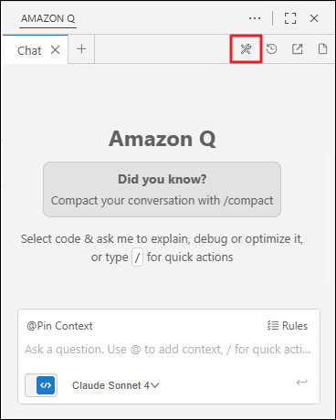
    <br>
  2. "+" 버튼을 누릅니다.
    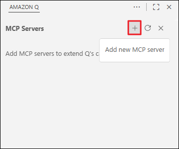
    <br>
  3. 아래와 같이 MCP 서버를 설정합니다.
    - Scope : Global
    - Name : AWS Knowledge MCP Server
    !!! info
        Name 설정 값은 임의로 지정하여도 괜찮습니다.
    
    - Transport : http
    - URL : https://knowledge-mcp.global.api.aws

    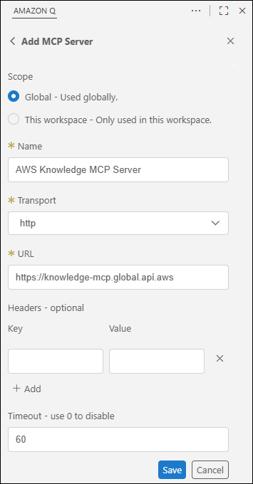
    <br>
  4. 설정이 완료되면, 해당 MCP 서버에서 사용가능한 도구(Tools)를 확인할 수 있습니다.
    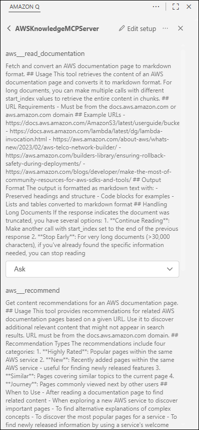


## Act 3: Amazon Q에서 MCP 사용
  1. 채팅에 ```/clear``` 명령어를 사용하거나, 상단 탭에서 "+" 버튼을 눌러, 새로운 채팅을 활성화합니다.
    
    <br>

  2. 아래 내용으로 Amazon Q에 질문하여, MCP 서버 (Tool)을 호출하는지 확인합니다.

    ```
    AI로 이미지를 생성하고자 합니다. AWS의 Bedrock FM 모델 중 어떤 모델을 사용하여 이미지를 생성할 수 있는지 최신 문서를 참고해서 답변하세요.
    ```
    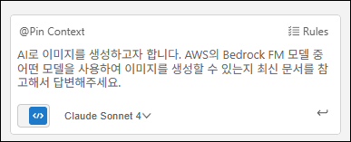
    <br>

  3. 채팅 중 도구 사용이 요청되면 "Run" 버튼을 눌러 Q가 해당 도구를 실행할 수 있도록 합니다.

    !!! info
        모든 MCP 서버는 기본적으로 도구 사용 여부를 사용자에게 확인합니다(Ask).
        Q가 자동으로 MCP 서버의 도구를 호출하도록 하려면, MCP 서버 설정에서 각 도구별 호출 옵션을 변경하면 됩니다.
    
    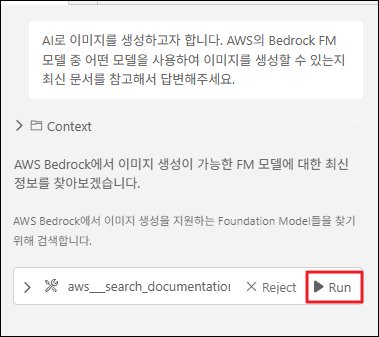

  4. 응답을 확인 및 검토합니다.
    
    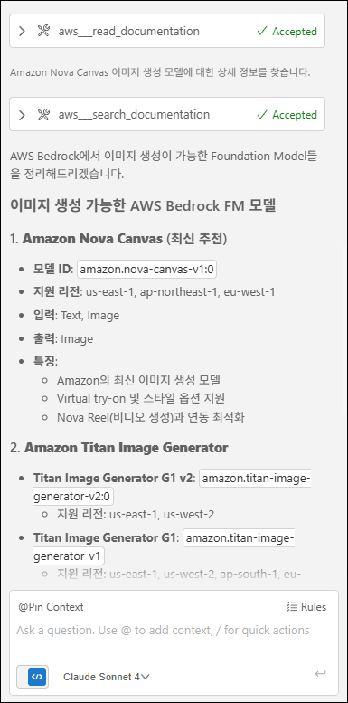


## Act 4: MCP 사용 Rule 추가
채팅에서 MCP 서버의 도구를 사용하려면, 관련된 요청을 자연어로 입력해야 합니다.  
예를 들어:  
- 최신 문서를 참고해서 답변하세요.  
- MCP 서버를 사용해 ~~를 하세요.

이러한 과정을 요약 및 자동화하기 위해 규칙을 추가하겠습니다.
  
  1. 채팅 입력 칸 우측에 "Rules" 버튼을 누르고, "Create a new rule"을 누릅니다.
    
    <br>

  2. ule name 을 ```mcp_rule```로 설정하고 "Create" 버튼을 누릅니다.
    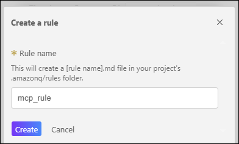
    <br>

  3. IDE에서 ```.amazonq/rules/project_rule.md``` 파일이 열린 것을 확인하고, 해당 파일에 아래 규칙을 추가(작성)합니다.
    ```markdown
    AWS 관련 질의 및 요청에는 항상 최신 문서를 기반으로 응답과 결과를 생성하도록 AWS Knowledge MCP Server의 도구를 사용하세요.
    ```

    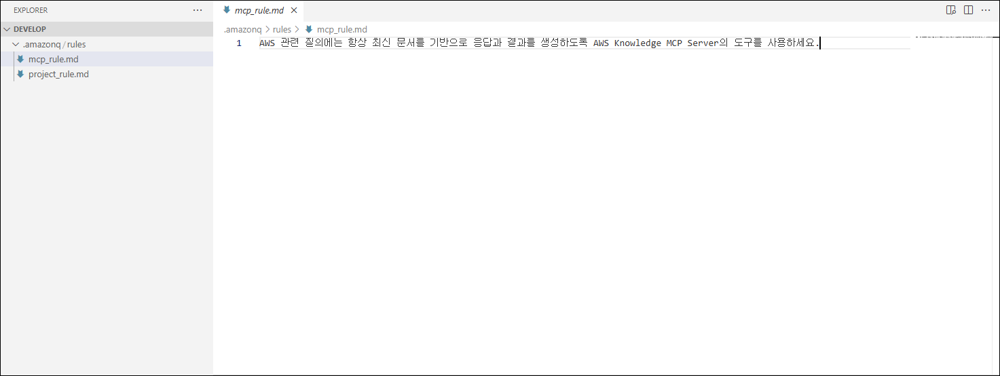
    <br>

  4. Rule이 정상적으로 적용됬는지 확인하기 위해 아래 내용으로 Amazon Q에 질문하여, MCP 서버 (Tool)을 호출하는지 확인합니다.
    ```
    AWS S3 버킷 조회 및 객체 업로드 예시 Python 코드를 작성하지 않고(파일 생성 없이) 답변과 함께 설명하세요.
    ```

    !!! warning
        "Active file" Context를 제거하고 진행해주세요.
    
    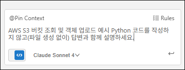
    <br>

  5. Amazon Q가 자동으로 Context가 추가하는지 확인하고, 해당 질문에 대해 어떻게 응답하는지 확인합니다

    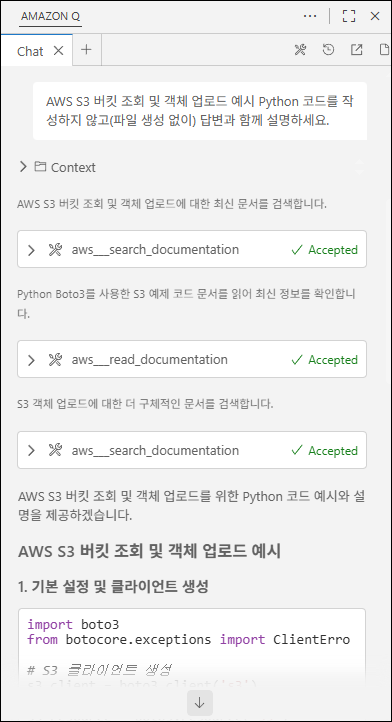


## 리소스 정리
  Amazon Q가 파일을 생성했다면 해당 파일을 삭제합니다.

!!! note
    이 정리 작업은 애플리케이션 구성 과정에서 불필요한 컨텍스트가 포함되지 않도록 하기 위함입니다.


## Tips
  1. 아래 AWS 문서에서 AWS Knowledge MCP Server와 같은 AWS 관련 MCP 서버를 확인할 수 있습니다.
  [AWS MCP Servers](https://awslabs.github.io/mcp/)
  <br>

  2. AWS에서 제공하는 MCP 서버 이외에도 다른 사용자가 만든 MCP 서버도 사용할 수 있습니다.
  [Smithery](https://smithery.ai/)


## 요약

이 워크숍 활동에서 다음 항목을 실습했습니다.

  - ✅ Amazon Q Rule 이해
  - ✅ Amazon Q MCP 서버 적용
  - ✅ Amazon Q MCP 서버 도구 호출
  - ✅ Amazon Q MCP 서버 도구 호출 자동화

다음 활동에서는 Amazon Q를 활용해서 실제 Application을 구성 실습을 해볼 것입니다.