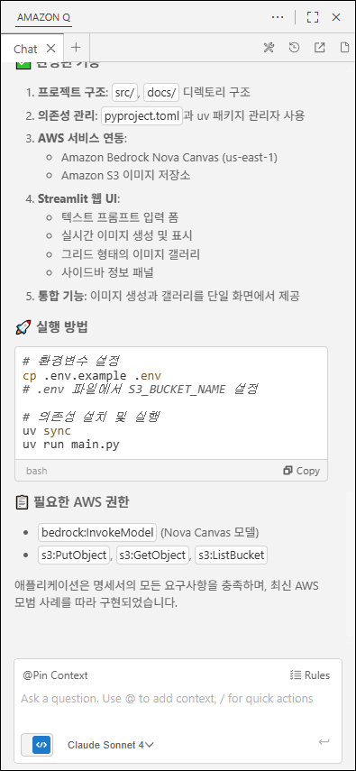
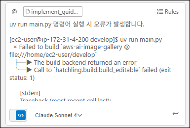
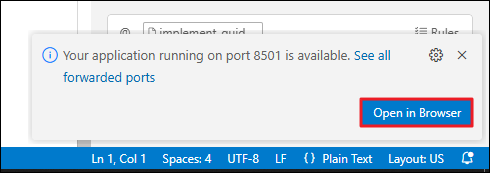
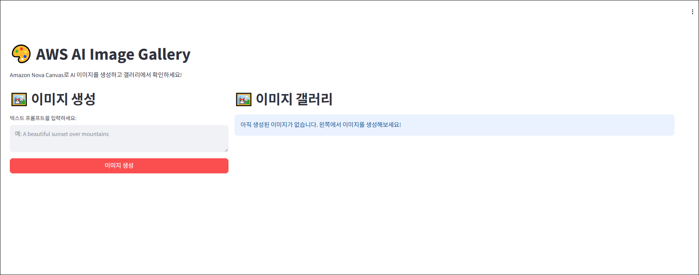
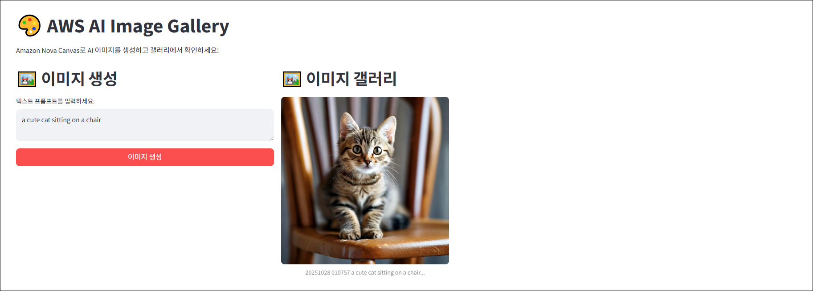

이 활동에서는 Amazon Q의 채팅, 에이전트, 규칙, MCP 기능을 종합적으로 활용하여 실제 웹 애플리케이션을 개발하는 전체 과정을 실습합니다. Amazon Q에 명확한 요구사항을 전달하여 개발 계획을 수립하고, 계획에 따라 코드를 구현하며, 발생하는 문제를 해결하는 과정을 통해 AI 기반 개발 생산성을 체험하는 것을 목표로 합니다.


## Act 1: 개발명세서 작성 (Plan)
1. 채팅에 ```/clear``` 명령어를 사용하거나, 상단 탭에서 "+" 버튼을 눌러, 새로운 채팅을 활성화합니다.

    
    <br>

2. 아래 내용으로 Amazon Q에 요청하여 개발명세서를 작성합니다.
    ```markdown
    Python Streamlit 프레임워크 기반으로 AWS AI Image Gallery 웹 애플리케이션을 구성하고자 합니다.

    - 사용할 AI 이미지 생성 모델: Amazon Nova Canvas
    - 주요 기능:
        - 사용자가 텍스트 프롬프트로 이미지를 생성 ( 다른 옵션 없이 Text로만 )
        - 생성된 이미지를 Amazon S3 버킷에 저장
        - 저장된 이미지를 웹에서 갤러리 형태로 조회
        - 이미지 생성 화면과 갤러리를 동일 뷰(한 화면)에서 동시에 표시

    해당 애플리케이션을 구성하기 위해 아래 항목이 포함된 구현 가이드를 `implement_guide.md` 문서로 작성하세요.
    (※ 해당 문서 작성 외에 다른 작업은 금지)
    1. 요구사항
    2. 기술 스택
    3. 구현 단계 (최대 5단계)

    추가 조건
        - 서버 메인 파일은 반드시 `src/app.py`로 지정하세요.
        - 프로젝트 루트에서 `uv run main.py` 명령어 실행 시 서버가 동작하도록 설정 가이드를 포함하세요.
        - 환경변수는 S3 버킷 이름과 리전을 받도록 하세요.  
        (단, AWS Bedrock 서비스 리전은 us-east-1로 고정)
        - 구현 가이드라인에는 테스트, 배포, 코드 최적화 관련 내용은 포함하지 마세요.
    ```
    


3. `docs/` 에 문서가 생성된 것을 확인하고, 생성된 문서의 내용을 검토합니다.

    !!!danger
        정교한 프롬프트를 구성해서 요청해도 같은 결과가 나오지 않을 수 있습니다.

    !!!note
        예시로 나온 implement_guide.md 파일은 다음과 같이 나왔으며, 해당 예시 파일를 그대로 사용하셔도 됩니다.

    ```markdown
    # AWS AI Image Gallery 구현 가이드

    ## 1. 요구사항

    ### 기능 요구사항
    - 텍스트 프롬프트를 통한 AI 이미지 생성 (Amazon Nova Canvas 사용)
    - 생성된 이미지를 Amazon S3 버킷에 자동 저장
    - 저장된 이미지를 갤러리 형태로 웹에서 조회
    - 이미지 생성과 갤러리를 동일 화면에서 동시 표시

    ### 기술 요구사항
    - Python Streamlit 프레임워크 기반 웹 애플리케이션
    - Amazon Nova Canvas 모델 (amazon.nova-canvas-v1:0) 사용
    - AWS Bedrock 서비스 리전: us-east-1 고정
    - 패키지 관리: uv 사용
    - 서버 메인 파일: `src/app.py`
    - 실행 명령어: `uv run main.py`

    ### 환경변수
    - `S3_BUCKET_NAME`: S3 버킷 이름
    - `AWS_REGION`: S3 버킷 리전 (예: us-east-1, ap-northeast-2)

    ## 2. 기술 스택

    ### 프론트엔드
    - **Streamlit**: 웹 UI 프레임워크
    - **Streamlit Components**: 이미지 표시 및 갤러리 구성

    ### 백엔드
    - **Python 3.9+**: 메인 개발 언어
    - **boto3**: AWS SDK for Python
    - **Pillow**: 이미지 처리

    ### AWS 서비스
    - **Amazon Bedrock**: AI 모델 호스팅 (Nova Canvas)
    - **Amazon S3**: 이미지 저장소

    ### 패키지 관리
    - **uv**: Python 패키지 관리자

    ## 3. 구현 단계

    ### 1단계: 프로젝트 구조 및 의존성 설정
    - 프로젝트 디렉토리 구조 생성 (`src/`, `docs/`)
    - `pyproject.toml` 파일 생성 및 의존성 정의
    - `main.py` 엔트리 포인트 파일 생성
    - 환경변수 설정 파일 구성

    **주요 의존성:**
        ```toml
        dependencies = [
            "streamlit>=1.28.0",
            "boto3>=1.34.0",
            "pillow>=10.0.0",
            "python-dotenv>=1.0.0"
        ]
        ```

    ### 2단계: AWS 서비스 연동 모듈 구현
    - AWS Bedrock 클라이언트 설정 (us-east-1 리전)
    - Amazon Nova Canvas 모델 호출 함수 구현
    - S3 클라이언트 설정 및 이미지 업로드 함수 구현
    - 이미지 생성 및 저장 통합 함수 구현

    **핵심 API 구조:**
        ```python
        # Nova Canvas 요청 구조
        {
            "taskType": "TEXT_IMAGE",
            "textToImageParams": {"text": prompt},
            "imageGenerationConfig": {
                "seed": random_seed,
                "quality": "standard",
                "width": 512,
                "height": 512,
                "numberOfImages": 1
            }
        }
        ```

    ### 3단계: Streamlit UI 구성
    - 메인 페이지 레이아웃 설정 (사이드바 + 메인 영역)
    - 텍스트 입력 폼 및 이미지 생성 버튼 구현
    - 실시간 상태 표시 (로딩, 성공, 오류)
    - 생성된 이미지 즉시 표시 기능

    ### 4단계: 이미지 갤러리 기능 구현
    - S3 버킷에서 이미지 목록 조회 함수
    - Streamlit columns를 활용한 그리드 레이아웃 갤러리
    - 이미지 메타데이터 표시 (생성일시, 프롬프트)
    - 페이지네이션 또는 무한 스크롤 구현

    ### 5단계: 통합 및 최적화
    - 이미지 생성과 갤러리를 단일 화면에 통합
    - 세션 상태 관리로 사용자 경험 개선
    - 오류 처리 및 사용자 피드백 메시지 구현
    - 성능 최적화 (이미지 캐싱, 비동기 처리)

    ## 실행 설정

    ### 환경변수 설정
        ```bash
        export S3_BUCKET_NAME="your-image-gallery-bucket"
        export AWS_REGION="us-east-1"
        ```

    ### 서버 실행
        ```bash
        # 프로젝트 루트에서 실행
        uv run main.py
        ```

    ### 파일 구조
        ```toml
        project/
        ├── main.py                 # 엔트리 포인트
        ├── pyproject.toml         # 프로젝트 설정
        ├── src/
        │   ├── app.py            # Streamlit 메인 애플리케이션
        │   ├── aws_services.py   # AWS 서비스 연동
        │   └── utils.py          # 유틸리티 함수
        └── docs/
            └── implement_guide.md # 구현 가이드 (본 문서)
        ```
    ```

## Act 2. 개발명세서 기반 구현 (Implement)
1. 생성된 개발명세서 문서(`docs/implement_guide.md`)를 Context로 추가하고,  
    아래 내용으로 Amazon Q에 요청하여 애플리케이션을 구성합니다.
    ```
    개발명세서 문서를 참고해서 애플리케이션을 구성하세요.
    ```

    !!! info
        프로젝트 규모가 작은 경우에는 전체 애플리케이션 구성을 한 번에 요청할 수 있습니다.
        하지만 규모가 큰 경우에는 더 높은 품질을 위해 단계별로 애플리케이션을 구성하실 것을 권장드립니다.

    
    <br>

2. 생성된 코드와 응답을 확인합니다.

    


## Act 3. 검증 및 테스트 (Verification & Test)

!!! warning
    해당 실습 과정부터 내용이 동일하지 않을 수 있습니다.

1. Code-Server 또는 IDE 환경에서  (Ctrl + \`)를 눌러서 터미널을 활성화합니다.

    

2. 생성된 응답의 내용을 참고해서 환경 변수를 설정합니다.
    ```
    # 환경변수 설정
    cp .env.example .env
    # .env 파일에서 S3_BUCKET_NAME 설정
    ```

    

    !!! warning
        `.env` 파일이 이미 생성되어 있을 수 있습니다.
    
3. 생성된 응답의 내용을 참고해서 터미널에서 서버를 실행합니다.
    ```bash
    uv sync
    uv run main.py
    ```

4. 터미널에서 에러가 발생한다면, 해당 에러 메세지 전체를 복사하거나, 일부를 복사하여 아래와 같이 Amazon Q에 이슈 해결 요청을 합니다.

    ```
    [명령어 입력 또는 행동 등] 시 아래와 같이 오류/이슈가 발생했습니다.
    [발생 오류 및 이슈 내용]
    ```

    제 경우에는 아래 절차로 진행했습니다.
    
    

    

5. 에러를 해결한 뒤, uv run main.py 명령어로 서버를 실행합니다.
   서버가 실행되면, Code-Server 브라우저 우측 하단에 "Open in Browser"를 눌러 웹앱을 확인합니다.

    !!! info
        해당 알림창이 사라졌을 경우, 우측 하단에 종 ( 🔔 ) 을 눌러 다시 표시할 수 있습니다.

    


    !!! warning
        보이는 화면이 다를 수 있습니다.

    

6. 원하는 이미지가 생성되는지 확인하고, 이미지가 버킷에 저장되고 갤러리에 표시되는지 확인합니다.

    

    

## 요약

이 워크숍 활동에서 다음 항목을 실습했습니다.

  - ✅ 프롬프트 엔지니어링
  - ✅ Amazon Q Developer를 활용한 개발명세서 작성
  - ✅ Amazon Q Developer를 활용한 개발명세서 기반 애플리케이션 구성
  - ✅ Amazon Q Developer로 이슈 및 오류 해결

다음 활동에서는 Amazon Q를 활용해서 구성된 웹앱에 기능을 추가하는 실습을 해볼 것입니다.