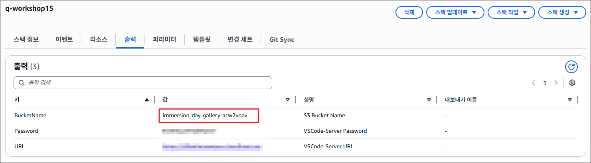
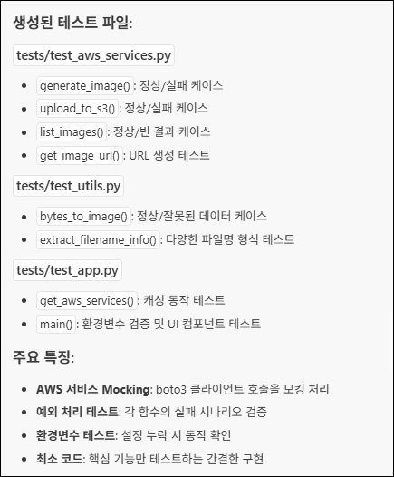

# Task 1: 애플리케이션 구현

이 활동에서는 Amazon Q Developer의 **Chat, Agent, Rules, MCP** 기능을 종합적으로 활용하여 실제 웹 애플리케이션을 처음부터 구축합니다. 

명확한 요구사항을 바탕으로 개발 계획을 수립하고, AI와 협업하여 코드를 구현하며, 발생하는 문제를 해결하는 전체 과정을 체험합니다.

---

## 🎯 학습 목표

- ✅ 효과적인 프롬프트 작성으로 개발 명세서 생성하기
- ✅ Agent 모드를 활용한 전체 프로젝트 구조 및 코드 자동 생성
- ✅ 생성된 애플리케이션 실행 및 오류 해결
- ✅ 단위 테스트 자동 생성으로 코드 품질 검증

---

## Act 1: 개발 명세서 작성 (Plan)

### 1-1. 새 채팅 세션 시작하기
  1. 채팅 입력창에 `/clear`를 입력하거나, 상단 탭에서 **"+"** 버튼을 클릭하여 새 채팅을 시작합니다.

    

    !!! note "새 채팅을 시작하는 이유"
        이전 대화 기록의 영향을 받지 않도록 깨끗한 상태에서 시작합니다. 프로젝트별로 독립적인 채팅 세션을 유지하는 것이 좋습니다.

### 1-2. 개발 명세서 생성 요청하기

  1. 다음 프롬프트를 입력하여 Amazon Q에게 구현 가이드 작성을 요청합니다:

    !!! quote "개발 명세서 생성 프롬프트"
        ```markdown
        Python Streamlit 프레임워크 기반으로 AWS AI Image Gallery 웹 애플리케이션을 구성하고자 합니다.

        - 사용할 AI 이미지 생성 모델: Amazon Nova Canvas
        - 주요 기능:
            - 사용자가 텍스트 프롬프트로 이미지를 생성 (다른 옵션 없이 Text로만)
            - 생성된 이미지를 Amazon S3 버킷에 저장
            - 저장된 이미지를 웹에서 갤러리 형태로 조회
            - 이미지 생성 화면과 갤러리를 동일 뷰(한 화면)에서 동시에 표시

        해당 애플리케이션을 구성하기 위해 아래 항목이 포함된 구현 가이드를 `docs/implement_guide.md` 문서로 작성하세요.
        (※ 해당 문서 작성 외에 다른 작업은 금지)
        
        1. 요구사항
        2. 기술 스택
        3. 구현 단계 (최대 5단계)

        추가 조건:
            - 서버 메인 파일은 반드시 `src/app.py`로 지정하세요.
            - 프로젝트 루트에서 `uv run main.py` 명령어 실행 시 서버가 동작하도록 설정 가이드를 포함하세요.
            - Bedrock 서비스 관련은 us-east-1 리전을 사용하도록 하세요.
            - 환경변수는 S3 버킷 이름과 버킷의 리전을 받도록 하세요.
            - 구현 가이드라인에는 테스트, 배포, 코드 최적화 관련 내용은 포함하지 마세요.
        ```

    !!! tip "효과적인 프롬프트 작성 요소"
        위 프롬프트는 다음 요소를 포함하고 있습니다:
        
        - ✅ **명확한 목표**: "Streamlit 기반 AI Image Gallery 구축"
        - ✅ **기술 스택 지정**: Amazon Nova Canvas, S3, Streamlit
        - ✅ **구체적인 기능 요구사항**: 4가지 핵심 기능
        - ✅ **산출물 형식 지정**: `docs/implement_guide.md` 문서
        - ✅ **제약 조건 명시**: 문서 작성만, 코드 생성 금지
        - ✅ **추가 조건**: 파일 구조, 실행 방법, 환경변수

    

### 1-3. 생성된 문서 검토하기

  1. `docs/` 디렉토리에 `implement_guide.md` 파일이 생성되었는지 확인합니다.

  2. 생성된 문서의 내용을 검토합니다:

    - **요구사항**: 기능 및 기술 요구사항이 명확히 정의되어 있는가?
    - **기술 스택**: 필요한 라이브러리와 AWS 서비스가 모두 포함되어 있는가?
    - **구현 단계**: 5단계 이하로 논리적으로 구성되어 있는가?

    !!! danger "LLM의 비결정성 (Non-deterministic Behavior)"
        동일한 프롬프트를 입력해도 **매번 다른 결과**가 생성될 수 있습니다. 이는 LLM의 정상적인 특성입니다.
        
        생성된 문서가 요구사항을 만족하지 않는다면:

        - 프롬프트를 더 구체적으로 수정하거나
        - "이 부분을 더 상세히 작성해줘"와 같은 추가 요청을 하세요.

    !!! example "샘플 `implement_guide.md`"
        [implement_guide.md](./files/implement_guide.md){:download}

---

## Act 2: 개발 명세서 기반 구현 (Implement)

### 2-1. Agent 모드 활성화하기

  1. 채팅 패널 하단의 **"Agentic"** 토글을 **활성화**합니다.

    !!! info "Agent 모드가 필요한 이유"
        프로젝트 구조 생성, 여러 파일 작성, 의존성 설정 등 **다중 파일 작업**을 자동으로 수행하기 위해 Agent 모드가 필요합니다.

### 2-2. 개발 명세서를 Context로 추가하기

  1. 채팅 입력창에서 `@`를 입력합니다.
  2. **Files** 메뉴에서 `docs/implement_guide.md`를 선택합니다.
  3. 선택한 파일이 입력창 상단에 Context로 표시되는지 확인합니다.

### 2-3. 애플리케이션 구현 요청하기

  1. 다음 프롬프트를 입력합니다:

    !!! quote "구현 요청 프롬프트"
        ```
        개발명세서 문서를 참고해서 애플리케이션을 구성하세요.
        ```

    !!! info "한 번에 vs 단계별 구현"
        **소규모 프로젝트 (파일 5개 이하)**: 한 번에 전체 구현 요청 가능
        
        **중대규모 프로젝트 (파일 5개 이상)**: 단계별로 나누어 구현 권장

        - "1단계만 구현해줘"
        - "2단계 AWS 서비스 연동 구현해줘"
        
        단계별 구현이 더 높은 품질과 제어력을 제공합니다.

    


### 2-4. 생성된 코드 검토하기

Agent가 작업을 완료하면 다음을 확인합니다:

  1. **생성된 파일 목록**:

    - `main.py`: 엔트리 포인트
    - `pyproject.toml`: 프로젝트 설정 및 의존성
    - `src/app.py`: Streamlit 메인 애플리케이션
    - `src/aws_services.py`: AWS Bedrock 및 S3 연동
    - `.env.example`: 환경변수 템플릿

  2. **코드 Diff 확인**:

    - 각 파일을 클릭하여 생성된 코드를 검토합니다.
    - 구현 가이드의 요구사항이 반영되었는지 확인합니다.

    

    !!! success "코드 생성 완료!"
        Agent가 자율적으로 프로젝트 구조를 생성하고 모든 필요한 파일을 작성했습니다!

---

## Act 3: 애플리케이션 실행 및 오류 해결

!!! warning "실습 환경에 따른 차이"
    이 단계부터는 실습 환경, 생성된 코드, AWS 설정에 따라 **결과가 다를 수 있습니다**.

### 3-1. 터미널 열기

  1. VS Code에서 **Ctrl + `** (백틱) 또는 **View → Terminal** 메뉴를 선택하여 터미널을 엽니다.

    

### 3-2. 환경변수 설정하기

  1. `.env.example` 파일을 `.env`로 복사합니다:

    !!! warning ".env 파일이 이미 존재하는 경우"
        Agent가 이미 `.env` 파일을 생성했을 수 있습니다. 이 경우 `cp` 명령 대신 직접 편집하세요.

    ```bash
    cp .env.example .env
    ```

  2. `.env` 파일을 열어 다음 환경변수를 설정합니다:
    S3 버킷 이름은 Cloudformation 스택 출력 화면에서 확인하실 수 있습니다.
    

    ```bash
    S3_BUCKET_NAME=immersion-day-gallery-acw2voav
    S3_REGION=us-east-1 // ap-northeast-2
    ```


### 3-3. 의존성 설치 및 서버 실행하기

  1. **의존성 설치**:

    ```bash
    uv sync
    ```

  2. **서버 실행**:

    ```bash
    uv run main.py
    ```

  3. **정상 실행 확인**

### 3-4. 오류 발생 시 해결하기

터미널에 오류가 표시된다면:

  1. **오류 메시지 전체를 복사**합니다.

  2. **Amazon Q에게 오류 해결 요청**:

    !!! quote "오류 해결 프롬프트"
        ```
        uv run main.py 실행 시 아래와 같은 오류가 발생했습니다.
        
        [오류 메시지 전체 붙여넣기]
        
        이 오류를 해결하는 방법을 알려주고, 필요한 코드 수정을 해주세요.
        ```

  3. **실제 예시**:

    

    

  4. **Amazon Q의 제안을 적용**하고 다시 서버를 실행합니다.

### 3-5. 웹 애플리케이션 확인하기

  1. 서버가 정상 실행되면, VS Code 우측 하단에 **"Open in Browser"** 알림이 표시됩니다.

  2. **"Open in Browser"** 버튼을 클릭하여 웹 브라우저에서 애플리케이션을 엽니다.

    !!! info "알림창이 사라진 경우"
        우측 하단의 종 아이콘 (🔔)을 클릭하여 알림을 다시 표시할 수 있습니다.

    

  3. **웹 애플리케이션 UI 확인**:

    

    !!! warning "화면이 다를 수 있습니다"
        생성된 코드에 따라 UI 디자인이 다를 수 있습니다. 핵심 기능(이미지 생성 폼, 갤러리)이 포함되어 있는지 확인하세요.

### 3-6. 기능 테스트하기

  1. **이미지 생성 테스트**:

    - 텍스트 프롬프트 입력 (예: "a cute cat sitting on a chair")

        !!! warning
            Amazon Nova Canvas는 아직 영어를 제외한 다른 언어를 지원하지 않습니다. 에러가 발생할 경우, 영어 프롬프트로 재시도 해주세요.
        
    - "Generate Image | 이미지 생성" 버튼 클릭
    - 생성된 이미지가 화면에 표시되는지 확인

    

---

## Act 4: 단위 테스트 자동 생성

애플리케이션이 정상 작동하는 것을 확인했다면, 이제 코드 품질을 검증하기 위한 **단위 테스트**를 생성합니다.

### 4-1. 테스트 생성 요청하기

  1. Amazon Q에게 다음 프롬프트를 입력합니다:

    !!! quote "단위 테스트 생성 프롬프트"
        ```
        src 폴더에 있는 파일의 주요 함수들에 대한 단위 테스트를 작성해주세요.
        
        pytest 프레임워크를 사용하고, 다음 사항을 포함하세요:
        - AWS 서비스 호출을 Mocking 처리
        - 정상 케이스 및 예외 케이스 테스트
        - 테스트 파일은 tests/test_[].py에 생성
        ```

### 4-2. 생성된 테스트 코드 검토하기

  1. Amazon Q가 생성한 테스트 파일을 확인합니다:
    

### 4-3. pytest 설치 및 테스트 실행하기

  1. test 명령어 실행
    ```
    uv run pytest
    ```

  2. 테스트 결과 확인  

    ??? example "출력 결과 예시"
        ```bash
        ec2-user:~/develop:$ uv run pytest
        == test session starts ==
        platform linux -- Python 3.9.23, pytest-8.4.2, pluggy-1.6.0
        rootdir: /home/ec2-user/develop
        configfile: pytest.ini
        plugins: mock-3.15.1
        collected 14 items                                                                                                                                                      

        tests/test_app.py ..                                                                                                                                              [ 14%]
        tests/test_aws_services.py .......                                                                                                                                [ 64%]
        tests/test_utils.py ...F.                                                                                                                                         [100%]

        == FAILURES =
        __ TestUtils.test_extract_filename_info_simple_format __

        self = <tests.test_utils.TestUtils object at 0x7fe67ed561c0>

            def test_extract_filename_info_simple_format(self):
                key = "generated_images/simple_file.png"
            
                timestamp, prompt = extract_filename_info(key)
            
        >       assert timestamp == "simple_file"
        E       AssertionError: assert 'simple_file.png' == 'simple_file'
        E         
        E         - simple_file
        E         + simple_file.png
        E         ?            ++++

        tests/test_utils.py:43: AssertionError
        == short test summary info ==
        FAILED tests/test_utils.py::TestUtils::test_extract_filename_info_simple_format - AssertionError: assert 'simple_file.png' == 'simple_file'
        == 1 failed, 13 passed in 0.56s ==
        ```

  3. 테스트 결과 제공 및 코드 수정 요청
    ```
    아래와 같이 테스트가 진행되었습니다.
    [테스트 결과 내용]

    테스트 내용을 참고하여 애플리케이션 코드를 수정하세요.
    ```

  4. 다시 테스트하여 결과값 확인 (반복)


### 4-4. 테스트 커버리지 확인 (선택사항)

더 심화된 검증을 원한다면 코드 커버리지를 확인하세요


  1. 의존성 설치 및 테스트 커버리지 실행
        ```bash
        uv add --dev pytest-cov
        uv run pytest --cov=src tests/
        ```

  2. 테스트 결과 확인  

    ??? example "출력 결과 예시"

        ```
        ec2-user:~/develop:$ uv run pytest --cov=src tests/
        == test session starts ==
        platform linux -- Python 3.9.23, pytest-8.4.2, pluggy-1.6.0
        rootdir: /home/ec2-user/develop
        configfile: pytest.ini
        plugins: mock-3.15.1, cov-7.0.0
        collected 14 items                                                                                                                                           

        tests/test_app.py ..                                                                                                                                   [ 14%]
        tests/test_aws_services.py .......                                                                                                                     [ 64%]
        tests/test_utils.py .....                                                                                                                              [100%]

        == tests coverage ==
        __ coverage: platform linux, python 3.9.23-final-0 __

        Name                  Stmts   Miss  Cover
        -----------------------------------------
        src/__init__.py           0      0   100%
        src/app.py               54     39    28%
        src/aws_services.py      34      0   100%
        src/utils.py             15      0   100%
        -----------------------------------------
        TOTAL                   103     39    62%
        == 14 passed in 0.69s ==
        ```

    !!! tip "커버리지 목표"
        - **80% 이상**: 양호
        - **90% 이상**: 우수
        - **100%**: 이상적이지만 모든 코드에 필수는 아님

---

## ✅ 요약

이 워크숍 활동에서 다음 항목을 실습했습니다:

- ✅ **효과적인 프롬프트 엔지니어링**: 명확한 요구사항으로 개발 명세서 생성
- ✅ **Agent를 활용한 자동 구현**: 전체 프로젝트 구조 및 코드 자동 생성
- ✅ **실전 문제 해결**: 오류 발생 시 Amazon Q와 협업하여 해결
- ✅ **기능 검증**: 실제 애플리케이션 실행 및 AWS 서비스 통합 확인
- ✅ **단위 테스트 생성**: pytest를 활용한 자동 테스트 코드 생성 및 실행
- ✅ **코드 품질 검증**: 테스트 커버리지를 통한 품질 확인

---

## 🚀 다음 단계

다음 실습에서는 구축한 애플리케이션에 **새로운 기능을 추가**합니다:

- `@workspace` Context를 활용한 전체 코드베이스 이해
- 기존 구조를 유지하면서 새 기능 통합
- 이미지 필터링 및 검색 기능 추가
- UI/UX 개선
