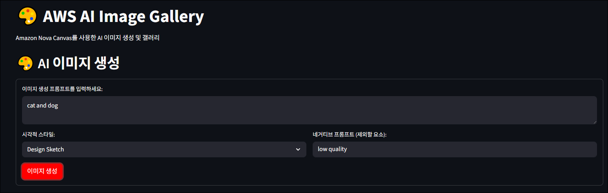
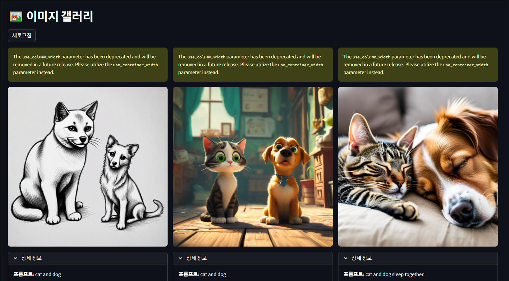

이전 활동에서 Amazon Q를 활용하여 이미지 갤러리 웹 애플리케이션의 기본 골격을 구성했습니다. 이번 활동에서는 한 단계 더 나아가, Amazon Q의 `@workspace` 컨텍스트 인덱싱 기능을 활용하여 프로젝트 전체 코드를 이해하고 새로운 기능을 추가하는 방법을 실습합니다. Amazon Nova Canvas 모델이 제공하는 다양한 옵션을 탐색하고, 이 중 일부를 실제 애플리케이션에 적용하는 과정을 통해 AI와 협력하여 소프트웨어를 점진적으로 발전시키는 경험을 해볼 것입니다.


## Act 1: 인덱싱 활성화
Amazon Q 요청에 Context `@workspace`를 포함하면, 작업 영역 내 코드 중 가장 관련성이 높은 청크를 자동으로 컨텍스트에 추가할 수 있습니다.  
Amazon Q Developer는 주기적으로 업데이트되는 인덱스를 기반으로 이러한 관련성을 판단합니다.

작업 영역 컨텍스트를 통해 Amazon Q는 파일 검색, 코드 간 의존 관계 파악, 열리지 않은 파일을 포함한 다중 파일 활용 등 향상된 기능을 제공합니다.

1. [Extensions] -> [Amazon Q] -> [Manage] -> [Settings] 을 눌러 Amazon Q 설정을 확인합니다.
    
    

2. `@workspace` Context 사용이 가능하도록 Index를 활성화합니다.

    

3. 채팅에 ```/clear``` 명령어를 사용하거나, 상단 탭에서 "+" 버튼을 눌러, 새로운 채팅을 활성화합니다.

    
    <br>

4. `@Pin Context`를 누르고 `@workspace`를 선택하여 Amazon Q에 요청 시 항상 작업 영역을 참고하도록합니다.

    

## Act 2: 이미지 생성 시 옵션 추가
아마 지금까지의 활동을 따라와서 애플리케이션을 만들었다면, 이미지 생성 시 프롬프트 입력 칸 하나만으로 이미지를 생성하게 됩니다.
이 활동에서 이미지 생성 시 프롬프트 뿐만 아니라 다른 옵션도 추가하여 이미지를 생성할 수 있도록 기능을 추가해볼 것입니다.


1. 아래 내용으로 Amazon Q에 질문하여 이미지 생성 기능에 대한 확장 방안을 확인합니다.
    ```
    현재 애플리케이션은 단일 입력 프롬프트를 Amazon Nova Canvas에 전달하여 이미지를 생성합니다.
    공식 문서를 참고해 Amazon Nova Canvas의 요청 구조(request syntax)를 분석하고, 이 애플리케이션을 확장할 수 있는 방안을 제안하세요. (코드 및 파일 생성 X)
    ```

    

    생성된 응답 예시:

    ```markdown
    # Amazon Nova Canvas 요청 구조 분석 및 확장 방안
    현재 애플리케이션의 요청 구조
    현재 애플리케이션은 가장 기본적인 TEXT_IMAGE 태스크만 사용하고 있습니다:

    Amazon Nova Canvas 완전한 요청 구조
    공식 문서 분석 결과, Nova Canvas는 다음과 같은 다양한 기능을 지원합니다:

    1. 지원되는 태스크 타입
    - TEXT_IMAGE: 텍스트 프롬프트로 이미지 생성
    - COLOR_GUIDED_GENERATION: 색상 팔레트 기반 생성
    - IMAGE_VARIATION: 기존 이미지의 변형 생성
    - INPAINTING: 이미지 일부 영역 수정
    - OUTPAINTING: 이미지 배경 확장
    - BACKGROUND_REMOVAL: 배경 제거
    - VIRTUAL_TRY_ON: 가상 착용 (의류/액세서리)

    2. 고급 파라미터들
    - cfgScale: 프롬프트 준수 강도 (1.0-20.0)
    - negativeText: 제외할 요소 지정
    - style: 8가지 사전 정의된 스타일
    - seed: 재현 가능한 결과를 위한 시드값
    - numberOfImages: 한 번에 생성할 이미지 수 (최대 4개)
    - 해상도: 320-4096px, 최대 4.19M 픽셀

    3. 시각적 스타일 옵션
    - 3D_ANIMATED_FAMILY_FILM
    - DESIGN_SKETCH
    - FLAT_VECTOR_ILLUSTRATION
    - GRAPHIC_NOVEL_ILLUSTRATION
    - MAXIMALISM
    - MIDCENTURY_RETRO
    - PHOTOREALISM
    - SOFT_DIGITAL_PAINTING

    애플리케이션 확장 방안
    1단계: 기본 파라미터 확장
    - 스타일 선택기: 드롭다운으로 8가지 사전 정의 스타일 제공
    - 네거티브 프롬프트: 제외할 요소 입력 필드 추가
    - CFG Scale 슬라이더: 창의성 vs 정확성 조절
    - 해상도 선택: 다양한 해상도 옵션 (512x512, 1024x1024, 1024x768 등)
    - 이미지 수량: 한 번에 생성할 이미지 개수 선택

    2단계: 이미지 편집 기능
    - 이미지 업로드: 기존 이미지 기반 작업을 위한 파일 업로더
    - 이미지 변형: 업로드된 이미지의 스타일 변경
    - 배경 제거: 자동 배경 제거 기능
    - 인페인팅: 이미지 일부 영역 수정 (마스크 프롬프트 사용)

    3단계: 고급 기능
    - 색상 가이드: 헥스 색상 코드로 색상 팔레트 지정
    - 가상 착용: 의류/액세서리 시뮬레이션
    - 배치 생성: 여러 프롬프트 동시 처리
    - 시드 관리: 마음에 드는 결과 재생성을 위한 시드 저장

    4단계: 사용자 경험 개선
    - 프리셋 관리: 자주 사용하는 설정 조합 저장
    - 프롬프트 히스토리: 이전 프롬프트 재사용
    - 이미지 비교: 다른 설정으로 생성된 결과 비교
    - 메타데이터 표시: 생성 파라미터 정보 표시

    5단계: 워크플로우 통합
    - 이미지 체인: 생성된 이미지를 다음 작업의 입력으로 사용
    - 템플릿 시스템: 특정 용도별 프롬프트 템플릿
    - 자동 태깅: 생성된 이미지의 자동 분류 및 태깅

    우선순위 추천
    - 즉시 구현 가능: 스타일 선택, 네거티브 프롬프트, CFG Scale
    - 단기 목표: 해상도 선택, 이미지 수량, 배경 제거
    - 중기 목표: 이미지 업로드 및 변형, 인페인팅
    - 장기 목표: 가상 착용, 색상 가이드, 고급 워크플로우
    - 이러한 확장을 통해 단순한 텍스트-이미지 생성기에서 종합적인 AI 이미지 편집 플랫폼으로 발전시킬 수 있습니다.
    ```

2. 생성된 응답을 기반으로, 아래와 같이 Amazon Q에 요청하여 사전 정의된 스타일 선택 기능과 네거티브 프롬프트 입력 기능을 구현합니다.

    ```
    현재 구성된 이미지 생성 애플리케이션에 사전 정의된 스타일 선택 기능과 네거티브 프롬프트 입력 기능을 추가하세요.
    변경된 내용은 `docs/changelog.md` 파일을 생성하여 기록하세요.
    ```

    

3. Amazon Q가 구현을 마치면 터미널에서 서버를 재부팅합니다. ( Ctrl + C -> `uv run main.py`)

4. 애플리케이션에서 새로 구현된 기능을 확인하고 정상 동작하는지 확인합니다.

    

    
