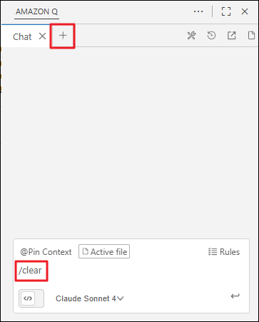

# Task 1: 애플리케이션 보완

이전 활동에서 Amazon Q를 활용하여 AI 이미지 갤러리 웹 애플리케이션의 기본 기능을 구현했습니다. 

이번 활동에서는 **`@workspace` Context**를 활용하여 프로젝트 전체 코드를 이해하고, 기존 구조를 유지하면서 **새로운 기능을 점진적으로 추가**하는 방법을 실습합니다. Amazon Nova Canvas 모델의 고급 옵션을 탐색하고 실제로 적용하는 과정을 통해, AI와 협력하여 소프트웨어를 발전시키는 경험을 체험합니다.

---

## 🎯 학습 목표

- ✅ `@workspace` Context 인덱싱을 활성화하고 활용하기
- ✅ 기존 코드베이스를 분석하여 일관성 있는 기능 추가하기
- ✅ Amazon Nova Canvas의 고급 파라미터 탐색 및 적용하기
- ✅ 변경 이력을 문서화하고 관리하기

---

## Act 1: Workspace 인덱싱 활성화

`@workspace` Context는 **프로젝트 전체 코드베이스**를 Amazon Q가 이해하고 참조할 수 있게 해주는 강력한 기능입니다.

### 1-1. `@workspace`

**`@workspace`는 다음과 같은 이점을 제공합니다:**

- 📁 **전체 프로젝트 참조**: 열리지 않은 파일도 자동으로 검색 및 분석
- 🔗 **코드 간 의존 관계 파악**: 함수 호출, 클래스 상속 등을 추적
- 🎯 **관련성 높은 코드 선택**: AI가 질문과 가장 관련 있는 코드 조각을 자동 선택
- 🧠 **컨텍스트 통합**: 여러 파일에 걸친 정보를 종합하여 정확한 답변 제공

!!! info "인덱싱이란?"
    Amazon Q Developer는 프로젝트의 모든 파일을 분석하여 **인덱스(색인)**를 생성합니다. 이 인덱스를 통해 AI가 대규모 코드베이스에서도 빠르게 관련 정보를 찾을 수 있습니다.
    
    인덱스는 **주기적으로 자동 업데이트**되므로, 코드 변경 사항이 자동으로 반영됩니다.

### 1-2. Workspace 인덱싱 설정

   1. **Amazon Q 설정 열기**:

      - VS Code에서 **[Extensions]** → **[Amazon Q]** → **[Manage]** → **[Settings]** 순서로 클릭합니다.

      

   2. **Index 활성화**:

      - **"Amazon Q: Workspace Index"** 옵션을 찾아 **체크박스를 활성화**합니다.

      

    !!! warning "초기 인덱싱 시간"
         프로젝트 크기에 따라 초기 인덱싱은 **5~20분** 소요될 수 있습니다. 
         
         - 소규모 프로젝트 (파일 10개 미만): 1~2분
         - 중규모 프로젝트 (파일 50개): 5~10분
         - 대규모 프로젝트 (파일 수백 개): 15~20분

### 1-3. 새 채팅 세션 시작

   1. 채팅 입력창에 `/clear`를 입력하거나, 상단 탭에서 **"+"** 버튼을 클릭하여 새 채팅을 시작합니다.

      

!!! note "새 채팅을 시작하는 이유"
    이전 대화의 Context가 섞이지 않도록 깨끗한 상태에서 시작합니다. 새로운 기능 추가 작업은 독립적인 세션에서 진행하는 것이 좋습니다.

### 1-4. `@workspace` Context 고정

   1. 채팅 입력창 상단의 **"@Pin Context"** 버튼을 클릭합니다.

   2. 드롭다운 메뉴에서 **`@workspace`**를 선택합니다.

   3. 선택한 `@workspace`가 입력창 상단에 고정되는지 확인합니다.

      

    !!! success "@workspace 활성화 완료!"
         이제 Amazon Q가 모든 질문에서 자동으로 프로젝트 전체를 참조합니다!

---

## Act 2: Amazon Nova Canvas 기능 확장 방안 탐색

**현재 구현된 기능:**

- ✅ 텍스트 프롬프트 입력
- ✅ 이미지 생성 및 표시
- ✅ S3 저장 및 갤러리 조회

### 2-1. 확장 방안 탐색 요청하기

  1. 다음 프롬프트를 입력하여 Amazon Q에게 확장 가능한 기능을 조사하도록 요청합니다:

    !!! quote "확장 방안 탐색 프롬프트"
         ```
         현재 애플리케이션은 단일 입력 프롬프트를 Amazon Nova Canvas에 전달하여 이미지를 생성합니다.
         공식 문서를 참고해 Amazon Nova Canvas의 요청 구조(request syntax)를 분석하고, 이 애플리케이션을 확장할 수 있는 방안을 제안하세요. (코드 및 파일 생성 X)
         ```

    !!! tip "프롬프트의 핵심 요소"
         - ✅ **현재 상태 명시**: "단일 입력 프롬프트만 사용"
         - ✅ **정보 소스 지정**: "공식 문서를 참고해"
         - ✅ **요청 범위 명확화**: "요청 구조(request syntax) 분석"
         - ✅ **산출물 제한**: "코드 및 파일 생성 X"
   
         이렇게 명확히 지시하면 Amazon Q가 **조사 단계**와 **구현 단계**를 분리하여 진행합니다.
    

### 2-2. Amazon Q의 분석 결과 검토
   - 결과 확인

    ??? example "예시 응답"
         ```
         Amazon Nova Canvas 요청 구조 분석 및 확장 방안
         공식 문서를 기반으로 Amazon Nova Canvas의 요청 구조를 분석하고 애플리케이션 확장 방안을 제안합니다.

         현재 애플리케이션의 요청 구조
         현재 애플리케이션은 기본적인 TEXT_IMAGE 태스크만 사용하고 있습니다

         Amazon Nova Canvas 완전한 요청 구조
         공식 문서에 따르면 Nova Canvas는 다음과 같은 다양한 기능을 지원합니다:

            1. 지원되는 태스크 타입
               - TEXT_IMAGE: 텍스트 → 이미지 생성
               - COLOR_GUIDED_GENERATION: 색상 팔레트 기반 생성
               - IMAGE_VARIATION: 이미지 변형 생성
               - INPAINTING: 이미지 내부 영역 수정
               - OUTPAINTING: 이미지 외부 영역 확장
               - BACKGROUND_REMOVAL: 배경 제거
               - VIRTUAL_TRY_ON: 가상 착용 (최신 기능)

            2. 고급 파라미터
               - cfgScale: 프롬프트 준수 강도 (1.0-20.0)
               - seed: 재현 가능한 결과를 위한 시드값
               - negativeText: 원하지 않는 요소 제외
               - style: 8가지 사전 정의된 스타일
               - quality: "standard" 또는 "premium"

         애플리케이션 확장 방안
            1. 기본 기능 확장
               - 스타일 선택기: 8가지 사전 정의된 스타일 옵션 제공
               - 고급 설정 패널: cfgScale, seed, negativeText 조정
               - 이미지 품질 옵션: standard/premium 선택
               - 다중 이미지 생성: numberOfImages 조정 (최대 4개)

            2. 이미지 편집 기능
               - 인페인팅: 기존 이미지의 특정 부분 수정
               - 아웃페인팅: 이미지 배경 확장
               - 배경 제거: 자동 배경 투명화
               - 이미지 변형: 기존 이미지 기반 새로운 버전 생성

            3. 고급 생성 기능
               - 색상 가이드: 헥스 색상 코드로 색상 팔레트 지정
               - 이미지 컨디셔닝: 참조 이미지의 레이아웃/구성 활용
               - 가상 착용: 의류/액세서리 가상 착용 시뮬레이션

            4. 사용자 경험 개선
               - 프리셋 관리: 자주 사용하는 설정 저장/불러오기
               - 배치 생성: 여러 프롬프트 일괄 처리
               - 히스토리 관리: 생성 기록 및 재생성 기능
               - 템플릿 시스템: 카테고리별 프롬프트 템플릿

            5. 워크플로우 통합
               - 이미지 편집 파이프라인: 생성 → 편집 → 재생성 워크플로우
               - A/B 테스트: 동일 프롬프트로 다른 설정 비교
               - 스타일 전이: 기존 이미지에 새로운 스타일 적용

         구현 우선순위
            - 1단계: 스타일 선택기, 고급 설정 패널
            - 2단계: 이미지 편집 기능 (인페인팅, 배경 제거)
            - 3단계: 가상 착용, 색상 가이드 기능
            - 4단계: 워크플로우 통합 및 배치 처리
         

         이러한 확장을 통해 단순한 텍스트-이미지 생성기에서 종합적인 AI 이미지 생성 및 편집 플랫폼으로 발전시킬 수 있습니다.
         ```

---

## Act 3: 스타일 선택 기능 구현

### 3-1. 기능 구현 요청

  - 다음 프롬프트를 입력하여 Amazon Q에게 구현을 요청합니다:

    !!! quote "기능 구현 프롬프트"
         ```
         현재 구성된 이미지 생성 애플리케이션에 사전 정의된 스타일 선택 기능을 추가하세요.
         변경된 내용은 `changelog.md` 문서를 생성하여 기록하세요.
         ```


### 3-3. 생성된 응답 및 코드 검토
   1. Amazon Q가 생성한 내용을 확인

    ??? example "예시 응답"
         
   
   2. 코드 변경 사항을 확인
   
    ??? example "예시 변경 사항"
         

   3. Changelog 문서를 확인

    ??? example "`changelog.md` 예시"
         ```
         # Changelog

         ## [1.1.0] - 2025-10-28

         ### Added
         - **스타일 선택 기능**: Amazon Nova Canvas의 사전 정의된 8가지 시각적 스타일 지원
         - 포토리얼리즘 (PHOTOREALISM)
         - 3D 애니메이션 (3D_ANIMATED_FAMILY_FILM)
         - 디자인 스케치 (DESIGN_SKETCH)
         - 플랫 벡터 (FLAT_VECTOR_ILLUSTRATION)
         - 그래픽 노블 (GRAPHIC_NOVEL_ILLUSTRATION)
         - 맥시멀리즘 (MAXIMALISM)
         - 미드센추리 레트로 (MIDCENTURY_RETRO)
         - 소프트 디지털 페인팅 (SOFT_DIGITAL_PAINTING)

         ### Changed
         - `AWSServices.generate_image()` 메서드에 선택적 `style` 파라미터 추가
         - Streamlit UI에 스타일 선택 드롭다운 추가
         - 테스트 케이스에 스타일 파라미터 검증 로직 추가

         ### Technical Details
         - Nova Canvas API의 `textToImageParams`에 `style` 필드 조건부 추가
         - 사용자 친화적인 한국어 스타일 이름과 API 값 매핑
         - 기본값은 스타일 없음으로 설정하여 기존 동작 유지

         ## [1.0.0] - 2025-10-27

         ### Initial Release
         - Amazon Nova Canvas를 이용한 텍스트-이미지 생성 기능
         - S3 자동 업로드 및 저장
         - Streamlit 기반 웹 인터페이스
         - 기본 이미지 갤러리 기능
         ```
---

## Act 4: 새 기능 테스트 및 검증

### 4-1. 서버 재시작

   1. **현재 실행 중인 서버 종료**:
      - 터미널에서 **Ctrl + C** (Windows/Linux) 또는 **Cmd + C** (Mac)를 누릅니다.

   2. **서버 재시작**:
      ```bash
      uv run main.py
      ```

### 4-2. 새 UI 확인

   1. 브라우저에서 애플리케이션을 엽니다.

   2. 스타일 선택 기능이 추가되었는지 확인합니다.

      

### 4-3. 스타일 선택 기능 테스트

   1. 텍스트 프롬프트를 입력 (예: 프롬프트 입력: "a modern office workspace with plants")

   2. 스타일을 선택. (예: 포토얼리즘(PHOTOREALISM))

   3. 이미지 생성

   4. 결과 확인 (예: 사실적인 스타일의 이미지가 생성되는지 확인)

      

---

## 💡 추가 도전 과제 (선택사항)

기본 실습을 완료했다면, 다음 기능에 도전해보세요:

   - **CFG Scale 슬라이더 추가**
   - **해상도 선택 기능**
   - **이미지 다운로드 버튼**
   - **프롬프트 히스토리**
   - **배치 생성 (Multiple Images)**
   - **이미지 업로드 및 변형**

---

## ✅ 요약

이 워크숍 활동에서 다음 항목을 실습했습니다:

- ✅ **`@workspace` Context 활성화**: 프로젝트 전체 코드베이스를 AI가 이해하도록 설정
- ✅ **기존 코드 분석**: AI가 자동으로 코드 구조와 패턴을 파악
- ✅ **점진적 기능 추가**: 스타일 선택 구현
- ✅ **일관성 있는 통합**: 기존 코드 스타일을 유지하며 확장
- ✅ **변경 이력 관리**: changelog.md로 문서화
- ✅ **실전 테스트**: 새 기능의 실제 작동 검증

---

## 🎉 워크숍 완료!

축하합니다! **Amazon Q Developer 워크숍**의 모든 실습을 완료했습니다.

### 배운 내용 총정리:

**1. 기본 기능 습득:**

- ✅ Chat: 효과적인 프롬프트 작성 및 Context 활용
- ✅ Agent: 자율적 코드 생성 및 다중 파일 작업
- ✅ Rules: 프로젝트별 코딩 표준 정의 및 적용
- ✅ MCP: 실시간 외부 데이터 소스 통합

**2. 실전 애플리케이션 구축:**

- ✅ 개발 명세서 작성
- ✅ 전체 프로젝트 구조 자동 생성
- ✅ AWS Bedrock 연동
- ✅ 단위 테스트 자동 생성

**3. 점진적 개선:**

- ✅ `@workspace`로 전체 코드베이스 이해
- ✅ 기존 구조 유지하며 새 기능 추가
- ✅ 변경 이력 문서화
